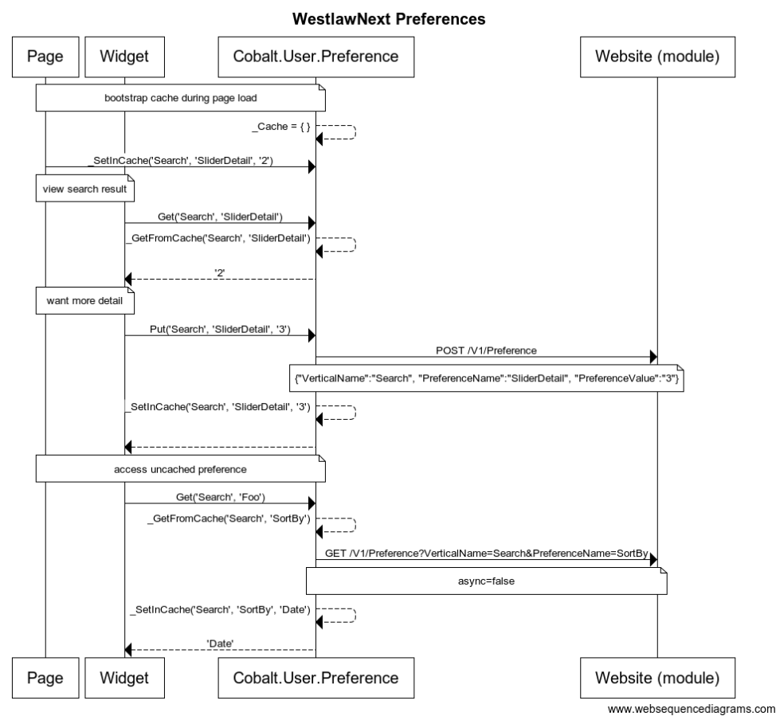
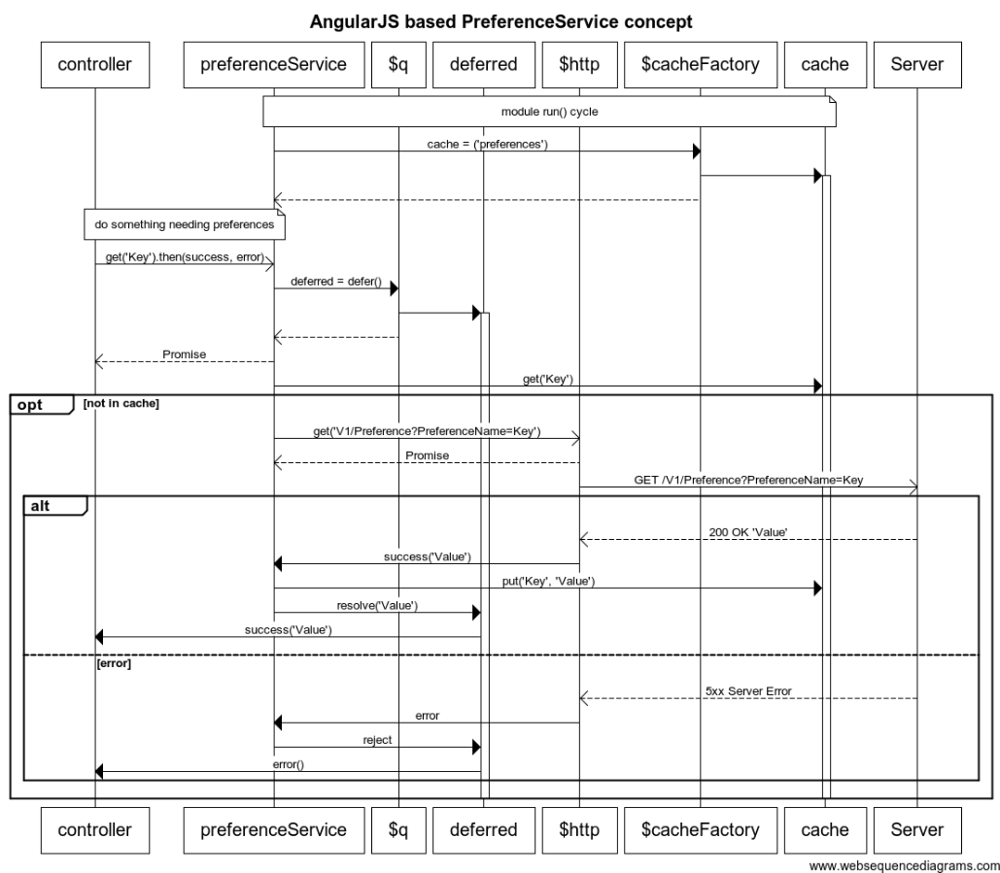

Our 2008 era Cobalt.js JavaScript code looks a bit substandard compared to what we would write today: We used a common Cobalt object off the global namespace, convention based private variables/functions prefixed by `_`, and (gasp) synchronous XHR requests so our APIs could avoid callbacks.

Here's a representative look at how WestlawNext accessed preferences from the browser:

If I was coding something similar today using features of [AngularJS](https://angularjs.org/), it would look more like this - utilizing [Dependency Injection](https://docs.angularjs.org/guide/di) and [$q](https://docs.angularjs.org/api/ng/service/$q) for Promises.

Why the trip down memory lane?  Also, why am I showing UML diagrams instead of code snippets?  I'm thinking about good software engineering patterns and practices in the browser and how to best communicate those across teams.  I like the UML notation of filled arrowheads for synchronous and stick arrowheads for asynchronous calls.  I like how UML shows the grouping for optional and alternate flows.  I mostly like that the reader needs to look at and understand the diagram concepts, and not just copy/paste the code and "debug" their way into understanding.  Since UML is a representation and not the code, it lets the reader map to any language (or any [compile to JavaScript language](https://github.com/jashkenas/coffeescript/wiki/List-of-languages-that-compile-to-JS) in this case). Maybe I just like pulling out my copy of Martin Fowler's [UML Distilled](http://martinfowler.com/books/uml.html).

Aside from critiques on my diagraming skills, what are your thoughts on UML vs. code snippets to communicate with other developers?