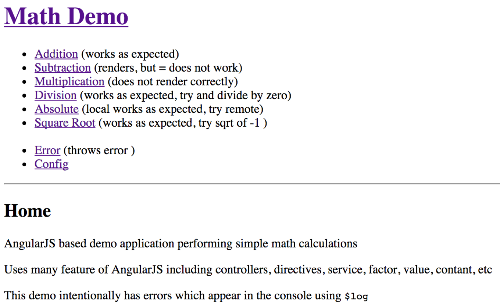

Logging is an important component of monitoring an application.  AngularJS provides [$log](https://docs.angularjs.org/api/ng/service/$log) which is documented as:

> Simple service for logging. Default implementation safely writes the message into the browser's console (if present).
>
>The main purpose of this service is to simplify debugging and troubleshooting.

I wanted to extend this front-end logging in a few ways, including named loggers and capturing these log messages alongside our back-end logs.  My Google results found some prior art in this area:

* [Logging client side errors server-side in AngularJS](http://engineering.talis.com/articles/client-side-error-logging/)
* [stacktrace.js](http://www.stacktracejs.com/)
* [log4javascript](http://www.stacktracejs.com/)
* [JSNLog AngularJS Error Handling](http://js.jsnlog.com/Documentation/GetStartedLogging/AngularJsErrorHandling)
* [ThomasBurleson angularjs-logDecorator](https://github.com/ThomasBurleson/angularjs-logDecorator)
* [Enhancing AngularJS Logging using Decorators](http://solutionoptimist.com/2013/10/07/enhance-angularjs-logging-using-decorators/)

For my experimentation, I created a simple AngularJS based application called "Math Demo" that intentionally has errors which appear in the console using `$log`.  Here is a screenshot of the home page:



I decorated `$log` with my log provider, used `app.name` (which is "math") as the default named logger, and configured the logging levels and server side endpoint.

```javascript
app.config(['$provide', 'fef$logProvider', function ($provide, fef$logProvider) {
  $provide.decorator('$log', [ "$delegate", function ($delegate) {
    fef$logProvider.decorate($delegate, app.name);

    return $delegate;
  }]);
}]);

app.run(['fef$log', function (fef$log) {
  fef$log.configure({ consoleThreshold: 5,
      httpThreshold: 5, httpURL: '/log'});
}]);
```

`fef$logProvider` supports the same API as `$log`, so when `binaryCalculator` loads...

```javascript
app.factory('binaryCalculator', function ($log) {
  $log.debug('loading');
```

... you see the "loading" message as expected, but prefixed by a timestamp and the top level `math` named logger.

```
2014-10-16T20:07:16.390Z [math] loading
```

But when the `unaryCalculator` is loading...

```javascript
app.service('unaryCalculator', function (fef$log, $q) {
  var $log = fef$log.logger('unaryCalculator');
  $log.debug('loading');
```

...the named logger is set to `math:unaryCalculator` and that appears in the output.

```
2014-10-16T20:07:34.616Z [math:unaryCalculator] loading
```

I added a debug level log message as output for `$routeChangeSuccess` events.

```javascript
$rootScope.$on("$routeChangeSuccess", function (event, aRoute, bRoute) {
  $log.debug(event.name);
  fef$log.pageguid(true);
})
```

The output to the browser console includes the event name in the named logger: `math:$rootScope.$on`

```
2014-10-16T19:42:07.019Z [math:$rootScope.$on] $locationChangeStart
2014-10-16T19:42:07.020Z [math:$rootScope.$on] $locationChangeSuccess  http://localhost:3000/#/ -> http://localhost:3000/#/unary/sqrt
2014-10-16T19:42:07.021Z [math:$rootScope.$on] $routeChangeStart
2014-10-16T19:42:07.027Z [math:$rootScope.$on] $routeChangeSuccess
2014-10-16T19:42:07.031Z [math:unaryEquation] loading
2014-10-16T19:42:07.034Z [math:unaryCalculator] loading
2014-10-16T19:42:07.034Z [math] loading
2014-10-16T19:42:07.035Z [math:UnaryOperatorCtrl] loading
2014-10-16T19:42:07.046Z [math:equationInput] loading
```

An internal tool for **TR**ransaction **M**onitoring and **R**eporting (TRMR) supports distributed tracing uses the `x-cobalt-pcid` HTTP header to provide the "page" or "root" level tracing GUID.  This code generates a [RFC 4122](https://www.ietf.org/rfc/rfc4122.txt) version 4 UUID and set the HTTP header.

```javascript
function trmrguid() {
  return 'xxxxxxxxxxxx4xxxyxxxxxxxxxxxxxxx'.replace(/[xy]/g,
  function (c) {
    var r = Math.random() * 16 | 0,
      v = c == 'x' ? r : (r & 0x3 | 0x8);
    return v.toString(16);
  });
}

var rootname = "fef", rootGuid = trmrguid();
function generatePageGuid($http) {
  rootGuid = trmrguid();
  $http.defaults.headers.common['x-cobalt-pcid'] = rootGuid;

  var data = createData(rootname);
  data.level = 'page';
  logHttp(data);
}
```

Log events are posted to the server side using a JSON structure containing the same timestamp,  logger name, and message output to the browser console.  It also includes the URL, logging level, and the tracability "root" guid generated above.

```json
{
  "version": "0.1",
  "items": [
  {
      "root": "b2ff983e5fe04316af5642a1fbd014ca",
      "name": "math:$rootScope.$on",
      "timestamp": "2014-10-16T19:47:49.308Z",
      "url": "http://localhost:3000/#/",
      "level": "debug",
      "messages": [
        "$routeChangeSuccess"
      ]
    },
    {
      "root": "433b218a10d24b6ead6988d004aeeff1",
      "name": "math",
      "timestamp": "2014-10-16T19:47:49.308Z",
      "url": "http://localhost:3000/#/",
      "level": "page"
    }
  ]
}
```

However, to avoid being to "chatty" over HTTP for each log message, there is a configurable minimum delay to buffer log events.

```javascript
var logBuffer = [];
function logHttp(logData) {
    if (logBuffer.length == 0) {
    // use setTimeout/XMLHttpRequest instead of
    // $timeout/$http to avoid circular errors
        setTimeout(function () {
            var logRequest = new XMLHttpRequest();
            logRequest.open("POST", baseConfig.httpURL);
            logRequest.setRequestHeader("Content-Type", "application/json");
            logRequest.send(JSON.stringify({ version: "0.1", items: logBuffer }));

            logBuffer = [];
        }, baseConfig.delay);
    }
    logBuffer.push(logData);
}
```

In this "Square Root" example, you can see the different components being used.


`/unary/:operation` routes to `unary.html` which references `<unary-equation>`

```html
<div>
    <h2>{{label}}</h2>
    <unary-equation></unary-equation>
    <div>
        (Calculate Remote:
        <input id="useRemote" name="useRemote”
             type="checkbox" ng-model="useRemote">)
    </div>
</div>
```

`unary-equation.html` references `<equation-input>` and renders the "calculate" button

```html
{{ operation }}
(
<equation-input name="x" ng-model="model.x"></equation-input>
)
<button ng-click="calculate()">=</button>
{{ result }}
```

`equation-input.html` renders the `<input>` field

```html
<input type="number" ng-required="true" placeholder="{{name}}">
```

In the browser console screenshot below, you can see each component does some debug logging while "loading".  There is also either "info" or "error" logging depending the the result of the `calculate` function.

```javascript
$scope.calculate = function () {
  $log.info('calculating...');

  var calculator = ($scope.useRemote ? unaryCalculatorRemote : unaryCalculator);

  calculator.compute($scope.model.x, $scope.operation).then(function (result) {
    $scope.result = result;
    $log.info(format($scope));
  }, function (reason) {
    $scope.result = null;
    $log.error(reason)
  });
};
```


The `ErrorCtrl` of this application exists just to throw a JavaScript `Error` with the message "thrown".

```javascript
function ErrorCtrl($scope, fef$log) {
  var $log = fef$log.logger('ErrorCtrl');
  $log.debug('loading');
  throw new Error('thrown');
}
```

And when the `/error` route is loaded, the stacktrace appears in the browser console.

```
2014-10-16T20:10:02.106Z [math:ErrorCtrl] loading
2014-10-16T20:10:02.107Z [math]  Error: thrown
    at new ErrorCtrl (http://localhost:3000/javascripts/math.js:50:9)
    at invoke (http://ajax.googleapis.com/ajax/libs/angularjs/1.2.26/angular.js:3966:17)
    at Object.instantiate (http://ajax.googleapis.com/ajax/libs/angularjs/1.2.26/angular.js:3977:23)
    at http://ajax.googleapis.com/ajax/libs/angularjs/1.2.26/angular.js:7281:28
    at link (http://ajax.googleapis.com/ajax/libs/angularjs/1.2.26/angular-route.js:907:26)
    at nodeLinkFn (http://ajax.googleapis.com/ajax/libs/angularjs/1.2.26/angular.js:6711:13)
    at compositeLinkFn (http://ajax.googleapis.com/ajax/libs/angularjs/1.2.26/angular.js:6105:13)
    at publicLinkFn (http://ajax.googleapis.com/ajax/libs/angularjs/1.2.26/angular.js:6001:30)
    at boundTranscludeFn (http://ajax.googleapis.com/ajax/libs/angularjs/1.2.26/angular.js:6125:21)
    at controllersBoundTransclude (http://ajax.googleapis.com/ajax/libs/angularjs/1.2.26/angular.js:6732:18) <ng-view class="ng-scope">
```

Additionally, an HTTP `POST` JSON payload is sent to the configured `httpURL` including that stacktrace and other logging fields.

```json
{
  "version": "0.1",
  "items": [
    {
      "root": "00f59ba88fe04df987bf774f0eae08c4",
      "name": "math",
      "timestamp": "2014-10-16T20:10:02.107Z",
      "url": "http://localhost:3000/#/error",
      "level": "error",
      "messages": [
          "Error: thrown",
          "<ng-view class=\"ng-scope\">"
      ],
      "stacktrace": [
          "new ErrorCtrl@http://localhost:3000/javascripts/math.js:50:9",
          "invoke@http://ajax.googleapis.com/ajax/libs/angularjs/1.2.26/angular.js:3966:17",
          "Object.instantiate@http://ajax.googleapis.com/ajax/libs/angularjs/1.2.26/angular.js:3977:23",
          "{anonymous}()@http://ajax.googleapis.com/ajax/libs/angularjs/1.2.26/angular.js:7281:28",
          "link@http://ajax.googleapis.com/ajax/libs/angularjs/1.2.26/angular-route.js:907:26",
          "nodeLinkFn@http://ajax.googleapis.com/ajax/libs/angularjs/1.2.26/angular.js:6711:13",
          "compositeLinkFn@http://ajax.googleapis.com/ajax/libs/angularjs/1.2.26/angular.js:6105:13",
          "publicLinkFn@http://ajax.googleapis.com/ajax/libs/angularjs/1.2.26/angular.js:6001:30",
          "boundTranscludeFn@http://ajax.googleapis.com/ajax/libs/angularjs/1.2.26/angular.js:6125:21",
          "controllersBoundTransclude@http://ajax.googleapis.com/ajax/libs/angularjs/1.2.26/angular.js:6732:18"
      ]
    }
  ]
}
```

On the server side, you can see the `$routeChange` events as well as the `ErrorCtrl` loading and the same "Error: thrown" message.

```
2014-10-16T20:10:02.097Z DEBUG [math:$rootScope.$on] $locationChangeStart
2014-10-16T20:10:02.098Z LOG   [math:$rootScope.$on] $locationChangeSuccess  http://localhost:3000/#/unary/abs -> http://localhost:3000/#/error
2014-10-16T20:10:02.099Z DEBUG [math:$rootScope.$on] $routeChangeStart
2014-10-16T20:10:02.104Z DEBUG [math:$rootScope.$on] $routeChangeSuccess
00f59ba88fe04df987bf774f0eae08c4 http://localhost:3000/#/error
2014-10-16T20:10:02.106Z DEBUG [math:ErrorCtrl] loading
2014-10-16T20:10:02.107Z ERROR [math] Error: thrown <ng-view class="ng-scope">
```

Now that I feel this concept is workable, it's time for a design review, including the JSON log format, and to write some unit tests before I ask teams to adopt this methodology.

---

**Update:** The early 2015 conclusion of this research is available on GitHub at [hakanson/mathdemo-angularjs](https://github.com/hakanson/mathdemo-angularjs).
