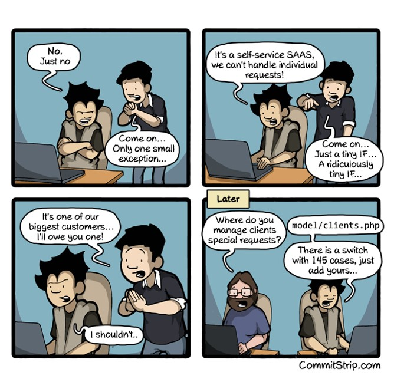
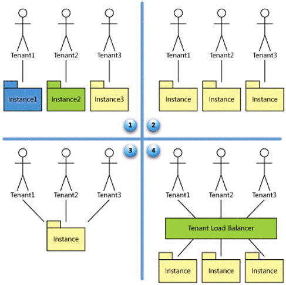
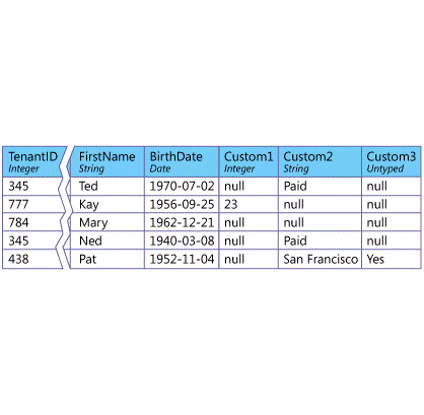
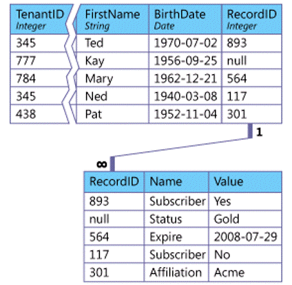

When searching for a definitive reference for SaaS customization, I found this CommitStrip [Just an exception they said…](https://www.commitstrip.com/en/2015/04/07/just-an-exception-they-said/) comic:

On a more serious note, I did find a SaaS Maturity Model from Microsoft (circa 2006) with four levels.

1. Ad Hoc/Custom
2. Configurable
3. Configurable, Multi-Tenant-Efficient
4. Scalable, Configurable, Multi-Tenant-Efficient

In the "Customization" vs. "Configuration" question, use of "Customization" can imply changes to source code.  Looking across a set of software products in my company, I found a couple broad areas of customization being done.

## User Interface / Branding
- Corporate "look & feel"
  - Graphics/logos, fonts, colors, etc.
  - Field labels
- Localization
- Jurisdiction
- Form / Screen Layout
- Screen Flow

## Workflow / Business Rules
- Business Logic
  - Show / Hide
  - Required / Not Required
  - List Values
  - Validation Rules (simple, intra-field, cross-entity)
- Accommodate differences in workflow steps, participants, triggers, etc.
  - e.g. require two approvals when more that $X

## Data Model Extensions

Going deeper into Data Model Extensions for relational databases, I found both the Fixed Extension Set and Custom Extensions documented by Microsoft., 

Teams cautioned me against using XML or JSON field types to hold sets of changes as data merge and replication conflicts will occur and be hard to resolve.

Any Data Model Extension implemented by a customer will also require:
- a corresponding extension to the business logic (so that the application can use the custom data)
- an extension to the presentation logic (so that users have a way to enter the custom data as input and receive it as output)

The configuration interface that you present to the customer should therefore provide mechanisms for updating all three, preferably in an integrated fashion.
