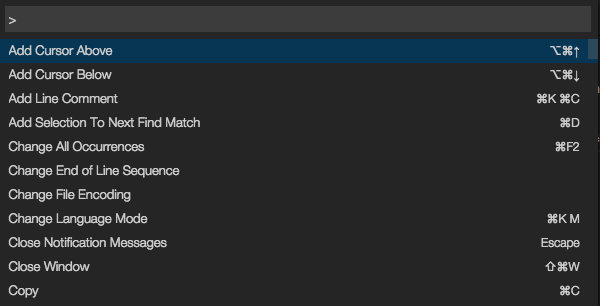
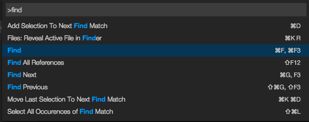
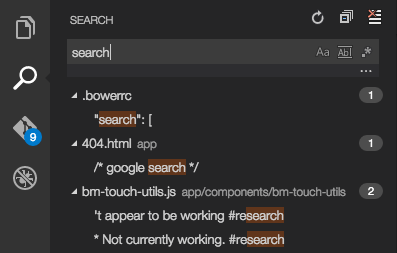

I've started using [Visual Studio Code](https://code.visualstudio.com/) for my web projects because it is the right balance between IDE features and lightweight text editor, multi-platform, and [open source](https://github.com/Microsoft/vscode/). One interesting feature of Code is the lightweight program menu structure with many features exposed via a **Command Palette**.

When you open the Command Palette, you are presented with a `>` prompt and a list of commands along with their keyboard shortcuts.

Hit backspace to clear the  `>` prompt, it shows **recently opened** files.

Start typing without the  `>` prompt, it also looks for **file and symbol results**.

With the  `>` prompt, the Command Palette is for running features in Visual Studio Code, including triggering actions like **Find** and **Search**.

Typing **find** and selecting that Command Palette item brings up the **Find** dialog in my current open file...

...and as I type into the **Find** input field, it highlights occurrences in that text of the file.

I can also use the Command Palette to initiate a full text **Search** across all files.

This finds occurrences of text across all files in my project and displays highlighted snippets and counts per file.

So why bother documenting what seems like an obvious feature of a software development tool? I'm trying to understand the best UX for a "global search" feature. We are conditioned to type anything we want into Google and getting a mix of search results, entities in the InfoBox or tools (try **calculator** or **english to spanish**). Is one input field the right UX for a product or should commands be split from full text search and quick access to entities? Add the dimension of voice interfaces and speech recognition for more confusion.