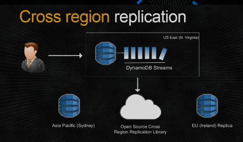

AWS DynamoDB (managed NoSQL database) appears to lag behind AWS RDS (managed relational database) w.r.t. some disaster recovery features:

* Backup/Restore
* Cross Region Replication
* Encryption at Rest

Related Videos:

* [AWS re:Invent 2014 | (SDD424) Simplifying Scalable Distributed Applications Using DynamoDB Streams - YouTube](https://www.youtube.com/watch?v=yHSuK_k3dxU)
* [AWS re:Invent 2015 | (DAT401) Amazon DynamoDB Deep Dive - YouTube](https://youtu.be/ggDIat_FZtA?list=PLhr1KZpdzukeMbjRqGswHX38DCqOHZ5GA)

## Backup/Restore

There is no "checkbox" for backup/restore and seems to require either using Data Pipeline and/or DynamoDB Streams to orchestrate.  See [DynamoDB: Backup & Recovery Solution](http://www.datahack.it/aws-dynamodb-backup-recovery/) for a potential solution.

**Cross Region Replication**

There is no "checkbox" for replication.  The official documentation has a "how to" article ([Cross-Region Replication Using DynamoDB Streams - Amazon DynamoDB](http://docs.aws.amazon.com/amazondynamodb/latest/developerguide/Streams.CrossRegionRepl.html) ) on using an awslabs open source solution: [GitHub - awslabs/dynamodb-cross-region-library: A library to facilitate cross-region replication with Amazon DynamoDB Streams](https://github.com/awslabs/dynamodb-cross-region-library)

Other replication options are discussed at [Planning for failures with Amazon DynamoDB | Sungard AS CTO Labs Blog](http://blog.sungardas.com/CTOLabs/2015/09/planning-for-failures-with-amazon-dynamodb-2/)

## Encryption at Rest

There is no "checkbox" for server-side encryption at rest and any solution requires client-side encryption.

* [Client-side Encryption for Amazon DynamoDB - AWS Developer Blog - Java](https://java.awsblog.com/post/TxI32GE4IG2SNS/Client-side-Encryption-for-Amazon-DynamoDB)
* [How to Protect the Integrity of Your Encrypted Data by Using AWS Key Management Service and EncryptionContext - AWS Security Blog](https://blogs.aws.amazon.com/security/post/Tx2LZ6WBJJANTNW/How-to-Protect-the-Integrity-of-Your-Encrypted-Data-by-Using-AWS-Key-Management)
* [GitHub - awslabs/aws-dynamodb-encryption-java: Amazon DynamoDB Encryption Client for Java](https://github.com/awslabs/aws-dynamodb-encryption-java)  

RDS, S3, and EBS all support server-side encryption.

* [Protecting Data Using Server-Side Encryption - Amazon Simple Storage Service](http://docs.aws.amazon.com/AmazonS3/latest/dev/serv-side-encryption.html)[
* [New – Amazon S3 Server Side Encryption for Data at Rest](https://aws.amazon.com/blogs/aws/new-amazon-s3-server-side-encryption/)
* [Data Encryption Made Easier – New Encryption Options for Amazon RDS | AWS Official Blog](https://aws.amazon.com/blogs/aws/new-encryption-options-for-amazon-rds/)
* [Amazon EBS Encryption - Amazon Elastic Compute Cloud](http://docs.aws.amazon.com/AWSEC2/latest/UserGuide/EBSEncryption.html)

## Summary

AWS DynamoDB does not have the same "checkbox" features related to disaster recovery that other AWS PaaS solutions include. Therefore, any solution that is looking at this managed NoSQL offering needs to manage these features as part of the application infrastructure.