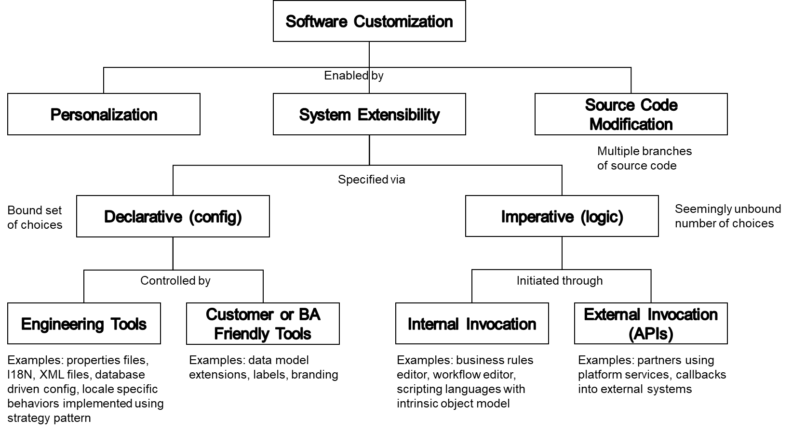

Building customizable systems is strategic to selling multi-tenant software.  Ideally these system support a number of factors while avoiding decreasing technical health.
- Global growth with a scalable localization model
- Customer specific customization (e.g. data model extensions for fields, relationships, or new objects)
- Rapid product development (declarative / no dependencies on engineering code)

Internationalization (I18N) and Localization (L10N) have well-known, open-source solutions.  This is important, and can be considered a prerequisite to custom labeling in the UI.

For terminology, I settled on these definitions:

- **Configurable**: A system that is can alter behavior or appearance based on parameters.  Parameters may be specified via code, configuration files, tables, etc.  Each configuration parameter generally results in a low and finite number of code paths (e.g. 10 types of search result ranking paths).
- **Extensible**: A system that can have its capabilities extended through data model extensions, behavioral extensions, and use of APIs to compose new capabilities and integrate with other systems.  This quality is not mutually exclusive with configurable.  Extensibility often has configuration in its implementation (e.g. configuration of an additional object field, like customer status).
  - Reference: [Open–closed principle](https://en.wikipedia.org/wiki/Open/closed_principle)  We don’t want to extend classes as an implementation – keep interface formal and rigid.
- **Customization**: Modifying source code to handle unique branches in logic / code paths for a specific deliverable.  Typically implemented by branching code or using "if/else if" logic.

To help visualize this, I created a Software Customization Taxonomy as a hierarchy and focused on **System Extensibility**.  I consider **Personalization** to be at user level (e.g. number of results per page). I wanted to avoid **Source Code Modification** as a single codebase where execution happens along multiple code paths is preferred over code branches. 

Configuration can be considered just good software engineering as it involves building capabilities into the system.  Configuration can take place at build, deployment or runtime.  However, one still needs to be careful as too much configuration can deteriorate the technical health of a system.

Today, these code paths typically makes use the strategy pattern and polymorphism, with a fixed number of behaviors statically defined in the build.  The open questions are best practices for imperative extensibility by customers.  Good engineering says to create a formal interface between core system and extension points with no leaky implementations, versioning, a way to "sandbox" extensions for security, and may other factors.
