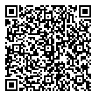
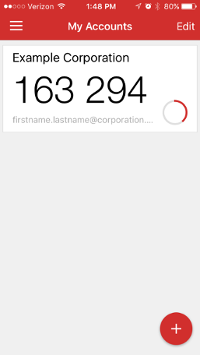
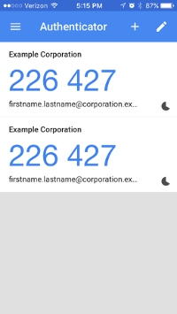

I recently got a new personal iPhone and realized that none of my accounts stored in Google Authenticator were restored via the iCloud backup restore process.  I thought it might be time to switch authenticator apps to something like [Authy](https://www.authy.com/app/), which supports encrypted backups and multiple devices (including desktop). 

So, I decided to try out some iOS Authenticator Apps using a stand-alone, in-browser, MFA demo website ([https://daplie.github.io/browser-authenticator/](https://daplie.github.io/browser-authenticator/)).  I was surprised by some fundamental UX issues I uncovered.

To test, I generated a "secret" for fake Issuer (`Example Corporation`) and fake Account `firstname.lastname@corporation.example.com`.  Here's the URI and QR code (feel free to steal my "secret"):

> otpauth://totp/Example%20Corporation:firstname.lastname@corporation.example.com?secret=XOJ4YXLNDHB7OLQFIIYW6E3NEXA5IEIE&issuer=Example%20Corporation&algorithm=SHA1&digits=6&period=30 
>
> 

Now for the UX problems I found with these apps since my iOS device set to a larger font and I used longer than "normal" Issuer and Account values.

First the [Authy iOS app](https://itunes.apple.com/us/app/authy/id494168017?mt=8), which uses a small square box for the truncated `Example Corp...` issuer and even more truncated `firstname.lastname@...` account.  There is no excuse since Authy has so much white space to work with here.  Also, notice how unreadable that light grey text is on a white background.

Next was the [Microsoft Authenticator iOS app](https://itunes.apple.com/us/app/microsoft-authenticator/id983156458?mt=8), which showed the full `Example Corporation` issuer, but truncated the `firstname.lastname@corporatio...` account.

Then was the [LastPass Authenticator iOS app](https://itunes.apple.com/us/app/lastpass-authenticator/id1079110004?mt=8), which shows a larger and full `Example Corporation` issuer and a  truncated `firstname.lastname@corporation...` account.  However, they could have moved the countdown timer up to make room for the full issuer and avoided that grey text.

Last was the [Google Authenticator iOS app](https://itunes.apple.com/us/app/google-authenticator/id388497605?mt=8), which showed the most information with the full `Example Corporation` issuer and a less truncated `firstname.lastname@corporation.ex...` account.  However, why are there two entries for a single QR code camera scan?  Before you answer "user error," I tried this twice and got the same result.

I was surprised they all had issues.  I even rotated the device for each app, hoping for more screen space, but no effect.

I guess you get what you pay for.  It looks like the market could use an Authenticator app built by a UX team.
