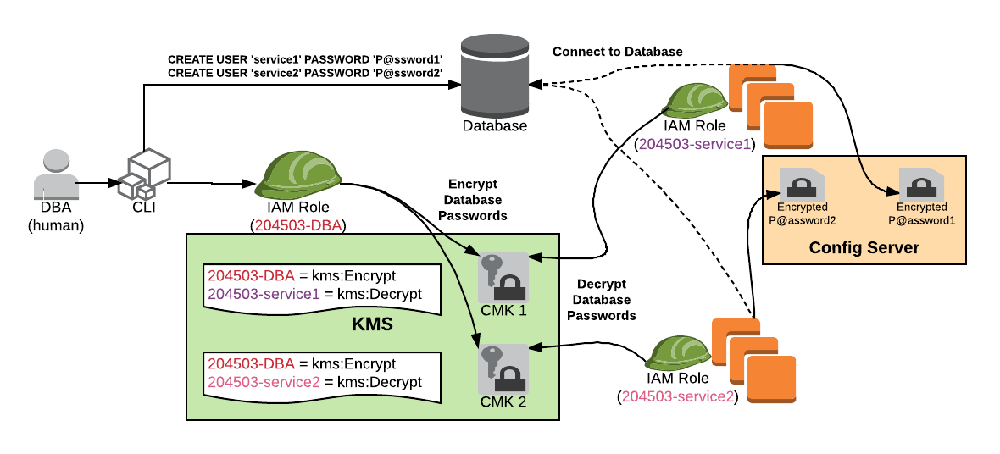

I was working on a pattern for application teams to secure and encrypt sensitive properties like database passwords.  Below is an interaction flow where the DBA for project 204503 can encrypt a property that only the intended microservice can decrypt.

In the diagram:

* A DBA human creates separate database users for service1 and service2
* Assuming the `204503-DBA` IAM Role, the DBA encrypts the service1 user's password (P@ssword1) and encrypts with CMK 1
  * Pre-condition: CMK 1 was created with a Resource Policy that allows `204503-DBA` to `kms:Encrypt`
* Assuming the `204503-DBA` IAM Role, the DBA encrypts the service2 user's password (P@ssword2) and encrypts with CMK 2
  * Pre-condition: CMK 2 was created with a Resource Policy that allows `204503-DBA` to `kms:Encrypt`
* The DBA puts the encrypted data into the location that deploys to the Config Server

Later, in the diagram:

* Instances of service1 are running with the `204503-service1` IAM Role
  * They retrieve the encrypted property from the Config Server
  * They decrypt the property using CMK 1
    * Pre-condition: CMK 1 was created with a Resource Policy that allows `204503-service1` to `kms:Decrypt`
  * They connect to the database
* Instances of service2 are running with the `204503-service2` IAM Role
  * They retrieve the encrypted property from the Config Server
  * They decrypt the property using CMK 2
    * Pre-condition: CMK 2 was created with a Resource Policy that allows `204503-service2` to `kms:Decrypt`
  * They connect to the database

Potentially, this could be altered to support an EncryptionContext with the service name as part of the key-value map.  See [How to Protect the Integrity of Your Encrypted Data by Using AWS Key Management Service and EncryptionContext](https://aws.amazon.com/blogs/security/how-to-protect-the-integrity-of-your-encrypted-data-by-using-aws-key-management-service-and-encryptioncontext/)) for more details and look for an upcoming post on the topic.
