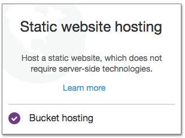

You may have read recent news about millions of Verizon customers having their data exposed (see [Experts Warn Too Often AWS S3 Buckets Are Misconfigured, Leak Data](https://threatpost.com/experts-warn-too-often-aws-s3-buckets-are-misconfigured-leak-data/126826/)).

Possibly, people are confused about what the **Authenticated Users group** means. From [Access Control List (ACL) Overview - Amazon Simple Storage Service](http://docs.aws.amazon.com/AmazonS3/latest/dev/acl-overview.html):

> Represented by [http://acs.amazonaws.com/groups/global/AuthenticatedUsers](http://acs.amazonaws.com/groups/global/AuthenticatedUsers).  
> This group represents all AWS accounts. Access permission to this group allows any AWS account to access the resource. However, all requests must be signed (authenticated).

This doesn't just mean IAM Users from their account, but _any_ user from _any_ AWS account.

How do we check this on our accounts?  There are a couple of options.

Use a [Cloud Custodian S3 filter ](http://www.capitalone.io/cloud-custodian/docs/policy/resources/s3.html) with a `policy.yml` like:

```yaml
policies:
- name: s3-global
  resource: s3
  description: Publicly Exposed S3 Buckets
  filters:
    - type: global-grants
```

Then run the [custodian](https://github.com/capitalone/cloud-custodian) tool and use [jq](https://stedolan.github.io/jq/) to filter the output, I find a bucket (names changed to protect the innocent).

```console
$ custodian run --output-dir=. policy.yml --region=us-west-2

$ jq '.[].Name' s3-global/resources.json
"project1-test-bucket1"
```

Amazon also has a utility called [Trusted Advisor](https://aws.amazon.com/premiumsupport/trustedadvisor/) that can report on several items, including **Amazon S3 Bucket Permissions**.  That has both a Console UI and is callable via API or CLI (via [describe-trusted-advisor-check-result](http://docs.aws.amazon.com/cli/latest/reference/support/describe-trusted-advisor-check-result.html)):

```console
$ aws support describe-trusted-advisor-check-result \
--check-id Pfx0RwqBli \
--query 'result.flaggedResources[*].metadata[2]'
[
    "project1-portal-ui",
    "project1-test-bucket1",
]
```

However, that list has 2 items vs. the 1 which Cloud Custodian found using its global-grants filter.  It appears that Cloud Custodian is filtering out buckets set up for website hosting (see [Hosting a Static Website on Amazon S3](https://docs.aws.amazon.com/AmazonS3/latest/dev/WebsiteHosting.html)), which seems like a valid result.

[](images/pastedImage_140.png)
