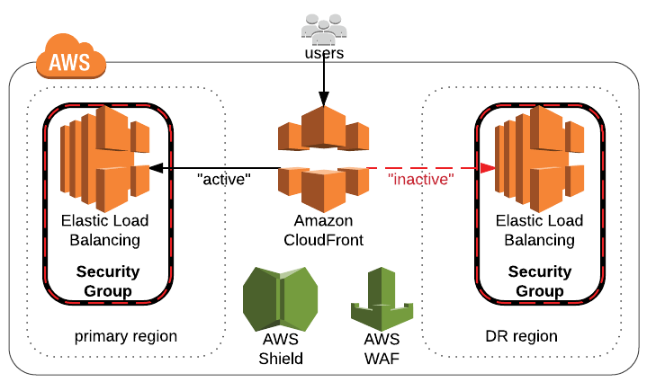

_Note:  If you need a refresher on CloudFront, start with [What Is Amazon CloudFront?](https://docs.aws.amazon.com/AmazonCloudFront/latest/DeveloperGuide/Introduction.html)_

After reading [Lambda@Edge Now Supports Content-Based Dynamic Origin Selection, Network Calls from Viewer Events, and Advanced Response Generation](https://aws.amazon.com/about-aws/whats-new/2017/11/lambda-at-edge-now-supports-content-based-dynamic-origin-selection-network-calls-from-viewer-events-and-advanced-response-generation/) (Posted On: Nov 21, 2017), I thought it was time to take another look at this feature.  Reviewing [Using CloudFront with Lambda@Edge](http://docs.aws.amazon.com/AmazonCloudFront/latest/DeveloperGuide/lambda-at-the-edge.html), I saw this interesting note:

> You can use a Lambda function to generate HTTP responses when CloudFront viewer request or origin request events occur.

That reminded me of the [F5 BIG-IP iRule](https://devcentral.f5.com/wiki/iRules.HomePage.ashx) we wrote for WestlawNext that would return a custom "We're Sorry" HTML page if no servers were available.  I'm not sure Lambda@Edge is the right fit or if [Customizing Error Responses](http://docs.aws.amazon.com/AmazonCloudFront/latest/DeveloperGuide/custom-error-pages.html) is better.  Regardless, it got me thinking about CloudFront's potential role in disaster recovery.

Consider this active/passive solution where CloudFront sits in front of the "active" region:

The product's DNS name points at the CloudFront distribution, and there you specify the name of the load balancer as your origin server.  This solution uses an ELB for that Web Distribution in the primary region. In the event of a disaster recovery cutover, that Web Distribution is updated to the name of the load balancer in the DR region. Contrast this with updating the products DNS entry to load balancer and waiting for TTL to pass.

For more background on CloudFront Custom Origins:

* [Working with Web Distributions](http://docs.aws.amazon.com/AmazonCloudFront/latest/DeveloperGuide/distribution-web.html)
* [Requirements and Recommendations for Using Amazon EC2 and Other Custom Origins)](http://docs.aws.amazon.com/AmazonCloudFront/latest/DeveloperGuide/CustomOriginBestPractices.html) 
* [Request and Response Behavior for Custom Origins](https://docs.aws.amazon.com/AmazonCloudFront/latest/DeveloperGuide/RequestAndResponseBehaviorCustomOrigin.html) 
* [Using AWS WAF to Control Access to Your Content](http://docs.aws.amazon.com/AmazonCloudFront/latest/DeveloperGuide/distribution-web-awswaf.html)
* [Configuring Alternate Domain Names and HTTPS](http://docs.aws.amazon.com/AmazonCloudFront/latest/DeveloperGuide/cnames-and-https-procedures.html) 

However, you now might want to limit traffic flowing into the regional ELBs.  Luckily, [Restricting ELB access to CloudFront](https://medium.com/cagataygurturk/restricting-elb-access-to-cloudfront-8b0990dea69f) is possible.  Amazon publishes the [Locations and IP Address Ranges of CloudFront Edge Servers](https://docs.aws.amazon.com/AmazonCloudFront/latest/DeveloperGuide/LocationsOfEdgeServers.html) in a JSON file and changes appear as an SNS topic.  This allows a Security Group created to restrict to CloudFront IP ranges to be updated whenever Amazon updates those ranges.

I'm sure that I am not the first person to consider this.  What do you think of using CloudFront as part of the Disaster Recovery cutover flow?