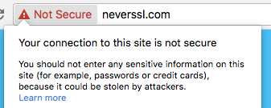

[Chromium Blog: A secure web is here to stay](https://blog.chromium.org/2018/02/a-secure-web-is-here-to-stay.html) put a deadline for marking HTTP as "Not Secure":

> Beginning in July 2018 with the release of Chrome 68, Chrome will mark all HTTP sites as “not secure”.

What if you want that behavior today?  Below are the configurations to change along with what it looks like accessing the intentionally "not secure" [http://neverssl.com/](http://neverssl.com/).

In Chrome go to `chrome://flags` and search for `mark-non-secure-as`

In Firefox go to `about:config` and search for `security.insecure_connection`

