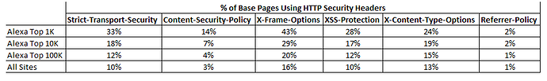

[Adoption of HTTP Security Headers on the Web](https://discuss.httparchive.org/t/adoption-of-http-security-headers-on-the-web/1259) looked at HTTP Archive data to do some analysis of the adoption of various HTTP security headers.  Here is a summary table of usage.

The analysis deep dives into each header, and which values are being sent, including misconfigured / invalid variations.  The author ends with this conclusion:

> There’s a lot that we can do with these security headers - but based on the data in the HTTP Archive it’s pretty clear that they are not being used enough and sometimes are being used incorrectly.

For additional reading, take a look at:

* [Content-Security-Policy HTTP Header Braindump](../2018-04-27-content-security-policy-http-header-braindump)
* [Referrer-Policy HTTP header](../2018-02-07-referrer-policy-http-header)
