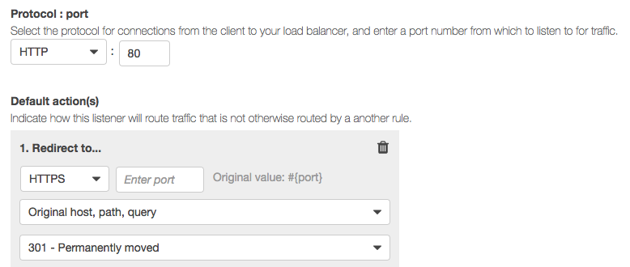

The recent efforts related to [Google and Mozilla are Deprecating Existing Symantec Certificates](https://blog.qualys.com/ssllabs/2017/09/26/google-and-mozilla-deprecating-existing-symantec-certificates) had me revisit another HTTPS topic:  HTTP to HTTPS Redirection.

**Redirection** is one of the items checked by [Observatory by Mozilla](https://observatory.mozilla.org/) and supported by the command line scanner.  Below is partial output from `httpobs-local-scan app1.example.com` containing the redirect flow:

```json
"redirection": {
    "destination": "https://app1.example.com/app/login?lastReqId=2362881&lkn=loginAllParms",
    "expectation": "redirection-to-https",
    "pass": false,
    "redirects": true,
    "result": "redirection-not-to-https-on-initial-redirection",
    "route": [
        "http://app1.example.com/",
        "http://app1.example.com/app/setcookie?lastReqId=2309797&lkn=cookieSetMachine",
        "http://app1.example.com/app/setcookie?lastReqId=22f4772&lkn=cookieSetMachine&noCookie=on",
        "http://app1.example.com/app/login?lastReqId=23754c6&lkn=loginAllParms",
        "https://app1.example.com/app/login?lastReqId=2362881&lkn=loginAllParms"
    ],
    "score_description": "Redirects to https eventually, but initial redirection is to another http URL",
    "score_modifier": -10,
    "status_code": 200
}
```

App1 is hosted in a company data center behind an F5 BIG-IP VIP, so some of the redirect logic can be found in iRules.  Notice that this rule on VIP Port 80 does a redirect based on a valid hostname.

```tcl
ltm rule app1.example.com_REDIR {
    when HTTP_REQUEST {
        if { (([HTTP::host] != "app1.example.com" )) } {
        HTTP::redirect "http://app1.example.com[HTTP::uri]"
    }
}
```

This could always just do an initial HTTPS redirect (which adds an additional redirect), but at least the cookies would be secure.  There is probably some application work in App1 to minimize the redirect counts.

```tcl
when HTTP_REQUEST {
    HTTP::redirect "https://app1.example.com[HTTP::uri]"
}
```

A scan of App2 passes.

```json
"redirection": {
    "destination": "https://app2.example.com/",
    "expectation": "redirection-to-https",
    "pass": true,
    "redirects": true,
    "result": "redirection-to-https",
    "route": [
        "http://app2.example.com/",
        "https://app2.example.com/"
    ],
    "score_description": "Initial redirection is to https on same host, final destination is https",
    "score_modifier": 0,
    "status_code": 200
}
```

It has the expected iRule on VIP Port 80 that always redirects to HTTPS.

```tcl
ltm rule APP2_REDIR_HTTP {
    when HTTP_REQUEST {
        HTTP::redirect "https://app2.example.com[HTTP::uri]"
    }
}
```

A scan of App3 shows a failure.

```json
"redirection": {
    "destination": "http://app3.example.com/",
    "expectation": "redirection-to-https",
    "pass": false,
    "redirects": false,
    "result": "redirection-missing",
    "route": [
        "http://app3.example.com/"
    ],
    "score_description": "Does not redirect to an https site",
    "score_modifier": -20,
    "status_code": 200
}
```

But the browser shows App3 is secure, which can be explained by looking at the network graph. The full site loads, then client-side JavaScript initiates a redirect (at the performance cost of about 1/2 second).

In AWS, CloudFront supports a Redirect HTTP to HTTPS (see [Requiring HTTPS for Communication Between Viewers and CloudFront - Amazon CloudFront](https://docs.aws.amazon.com/AmazonCloudFront/latest/DeveloperGuide/using-https-viewers-to-cloudfront.html) )


AWS ELB requires you to configure this in your web server (see [Redirect HTTP Traffic to HTTPS Using ELB](https://aws.amazon.com/premiumsupport/knowledge-center/redirect-http-https-elb/) ) but ALB now supports redirects as an option on the HTTP listener.



The Apache rewrite rule is below and would be the recommended approach for App3.

```
RewriteEngine On
RewriteCond %{HTTP:X-Forwarded-Proto} =http
RewriteRule .* https://%{HTTP:Host}%{REQUEST_URI} [L,R=permanent]
```

Now, take a couple minutes and go read [The WiFi Pineapple - Using Karma and SSLstrip to MiTM secure connections](https://scotthelme.co.uk/wifi-pineapple-karma-sslstrip/)  


Let me highlight a key point of this attack:

> SSLstrip works by monitoring HTTP traffic and waiting for links or redirects that use HTTPS. Once it finds a link or redirect using HTTPS it will transparently re-write it to the HTTP equivalent and pass it along to the victim.

Given that HTTP to HTTPS redirection isn't sufficient to protect our applications, what now? Make sure to leverage security focused HTTP headers, including [Strict-Transport-Security](https://developer.mozilla.org/en-US/docs/Web/HTTP/Headers/Strict-Transport-Security) and [Content-Security-Policy](https://developer.mozilla.org/en-US/docs/Web/HTTP/Headers/Content-Security-Policy).

```
Strict-Transport-Security: max-age=31536000;
Content-Security-Policy: upgrade-insecure-requests;
```

The iRule code to set these looks like

```tcl
when HTTP_RESPONSE {
     HTTP::header replace "Strict-Transport-Security" "max-age=31536000;"
     HTTP::header replace "Content-Security-Policy" "upgrade-insecure-requests;"
}
```

And for use in an Apache config

```xml
<IfModule mod_headers.c>
   Header set Strict-Transport-Security "max-age=31536000;"
   Header set Content-Security-Policy "upgrade-insecure-requests;"
</IfModule>
```

Because the browser "remembers" to always connect over HTTPS, there is both a security gain and a performance gain of skipping the first round-trip just for HTTP to HTTPS redirection.

Later on, the Content-Security-Policy could be updated to ensure only https connections, but this has the side effect of not allowing inline scripts or styles.

> default-src https:; form-action https:; connect-src https: wss:; upgrade-insecure-requests
