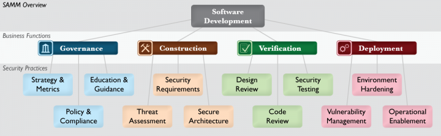

Recently I started leading a virtual team of software engineers we called the "security guild."  Our job was to work with application teams to improve our security posture, not by writing policy documents, but by writing code and pairing with those teams releasing software to customers.  As I was hydrating the backlog for this group, I used the Security Practices of the OWASP Software Assurance Maturity Model (OWASP SAMM) as a categorization tool.  I liked this because it was both an established model, and could set up teams for future SAMM Assessments.

The diagram and descriptions below come from the [OWASP SAMM Project](https://www.owasp.org/index.php/OWASP_SAMM_Project#tab=Browse_Online) website.

> 
>
> * [Governance](https://www.owasp.org/index.php/SAMM_-_Governance)
>   * The **Strategy & Metrics** (SM) Practice is focused on establishing the framework within an organization for a software security assurance program.
>   * The **Policy & Compliance** (PC) Practice is focused on understanding and meeting external legal and regulatory requirements while also driving internal security standards to ensure compliance in a way that’s aligned with the business purpose of the organization.
>   * The **Education & Guidance** (EG) Practice is focused on arming personnel involved in the software life-cycle with knowledge and resources to design, develop, and deploy secure software.
> * [Construction](https://www.owasp.org/index.php/SAMM_-_Construction)
>   * The **Threat Assessment** (TA) Practice is centered on identification and understanding the project-level risks based on the functionality of the software being developed and characteristics of the runtime environment.
>   * The **Security Requirements** (SR) Practice is focused on proactively specifying the expected behavior of software with respect to security.
>   * The **Secure Architecture** (SA) Practice is focused on proactive steps for an organization to design and build secure software by default.
> * [Verification](https://www.owasp.org/index.php/SAMM_-_Verification)
>   * The **Design Review** (DR) Practice is focused on assessment of software design and architecture for security-related problems.
>   * The **Code Review** (CR) Practice is focused on inspection of software at the source code level in order to find security vulnerabilities.
>   * The **Security Testing** (ST) Practice is focused on inspection of software in the runtime environment in order to find security problems.
> * [Deployment](https://www.owasp.org/index.php/SAMM_-_Deployment)
>   * The **Vulnerability Management** (VM) Practice is focused on the processes within an organization with respect to handling vulnerability reports and operational incidents
>   * The **Environment Hardening** (EH) Practice is focused on building assurance for the runtime environment that hosts the organization’s software.
>   * The **Operational Enablement** (OE) Practice is focused on gathering security critical information from the project teams building software and communicating it to the users and operators of the software.

One of the first work items created and assigned to everyone on the team was "Review OWASP SAMM Concepts" which I categorized as "Governance -> Education & Guidance."  One of the first things I learned was that "Deployment" was transitioning to be called "Operations" and that OWASP SAMM was previously referred to as [OpenSAMM](http://www.opensamm.org/).

Other than the item above, we didn't want to focus on an "Governance" practices.  Many of our early ideas fell under the "Deployment -> Environment Hardening" (e.g. NGINX Security Lockdown) or the "Verification -> Security Testing" (e.g. Automate "Observatory by Mozilla" Scans) categories.
