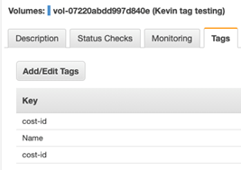
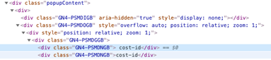
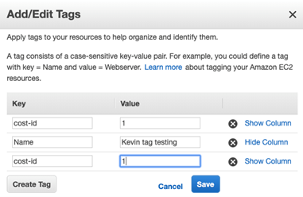
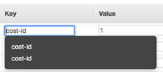
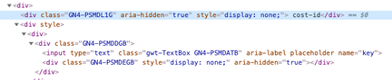
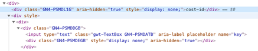

The Cloud Center of Excellence at my company was beginning to strictly enforce the tagging standard, which meant that mis-tagged resources were going to be deleted.  The CCoE gave reasonable lead time, and even provided  a list of affected resources.  However, when "delete day" came, one of my teams lost a few resources.  They claimed they verified everything on the list using the AWS Console UI.  Something didn't add up, so I started an investigation which lead to a bug being reported to AWS Enterprise Support.

Since I was documenting this problem for an AWS support case, I wanted to share the specific cli version I was using to reproduce the problem.

```console
$ aws --version
aws-cli/1.15.37 Python/3.6.5 Darwin/18.0.0 botocore/1.10.37
```

The problem resources were EC2 volumes, so I created one using the CLI and set one of the tag keys to `" cost-id"` which has a leading space.  Note that in the resulting output, that key came back as `"cost-id"` without the space.  I even created this resource with both `" cost-id"` and `"cost-id"` as keys, making the output even more confusing because it looks like I have a duplicate tag during the `creating` state.

```console
$ aws --region us-east-1 ec2 create-volume --availability-zone us-east-1a --size 1 --volume-type standard \
  --tag-specifications '{"ResourceType":"volume", "Tags":[{"Key":"Name","Value":"Kevin tag testing"}, {"Key":" cost-id","Value":"1"}, {"Key":"cost-id","Value":"1"}]}'
{
    "AvailabilityZone": "us-east-1a",
    "CreateTime": "2019-05-23T15:08:58.000Z",
    "Encrypted": false,
    "Size": 1,
    "SnapshotId": "",
    "State": "creating",
    "VolumeId": "vol-07220abdd997d840e",
    "Tags": [
        {
            "Key": "Name",
            "Value": "Kevin tag testing"
        },
        {
            "Key": "cost-id",
            "Value": "1"
        },
        {
            "Key": "cost-id",
            "Value": "1"
        }
    ],
    "VolumeType": "standard"
}
```

However, the tag keys are returned correctly from the `describe-volumes` cli command when in the `available` state.

```console
$ aws --region us-east-1 ec2 describe-volumes --filters '[{"Name":"volume-id", "Values":["vol-07220abdd997d840e"]}]'
{
    "Volumes": [
        {
            "Attachments": [],
            "AvailabilityZone": "us-east-1a",
            "CreateTime": "2019-05-23T15:08:58.926Z",
            "Encrypted": false,
            "Size": 1,
            "SnapshotId": "",
            "State": "available",
            "VolumeId": "vol-07220abdd997d840e",
            "Tags": [
                {
                    "Key": " cost-id",
                    "Value": "1"
                },
                {
                    "Key": "cost-id",
                    "Value": "1"
                },
                {
                    "Key": "Name",
                    "Value": "Kevin tag testing"
                }
            ],
            "VolumeType": "standard"
        }
    ]
}
```

Now I have a resource that reproduces my problem with a leading space in the tag key.  However, when you view these tags in the AWS Console, you **do not** see leading spaces unless you inspect the HTML elements.  If there was only a single `"cost-id"` tag, there would be no visual clue that something is wrong.  It is only because my test case has both `"cost-id"` and `" cost-id"` that makes this appear odd.
 




So assuming you were going to verify the tag name, and you went to edit them, the leading space on `" cost-id"` is still not visible and missing from the UI.



When you attempt to edit the tag key, the suggestions drop down list shows two options which look the same (no leading spaces), even though the first includes a leading space from inspecting the HTML).  Also, note the cursor is in the first position because the textbox does not contain the leading space, making editing (or validating) via AWS Console UI impossible.
 



Inspecting the HTML on the `<input>` fields is even more confusing.  There is a related hidden `<div>` with the actual value (first tag with a space, second without) but not on what the user interacts with.  It looks like I can blame [Google Web Tookit](http://www.gwtproject.org/) for this [Rube Goldberg machine](https://en.wikipedia.org/wiki/Rube_Goldberg_machine) generated HTML.

 
 


Luckily, I work for a company with AWS Enterprise Support and was able to get bug reported directly.  This was an interesting problem and required my "full stack architect" skills from the command line to the browser developer tools.