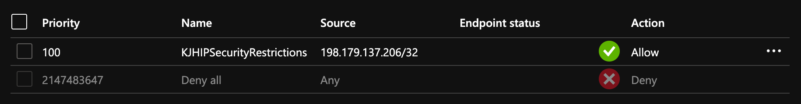

For a proof-of-concept I was working on, I needed to add an IP access restriction to an Azure App Service instance.  This can easily be done in the Portal UI, but not via PowerShell according to [Programmatic manipulation of access restriction rules](https://docs.microsoft.com/en-us/azure/app-service/app-service-ip-restrictions#programmatic-manipulation-of-access-restriction-rules).

> There currently is no CLI or PowerShell for the new Access Restrictions capability but the values can be set manually with an Azure REST API PUT operation on the app configuration in Resource Manager.

I decide to open up [Azure Cloud Shell](https://shell.azure.com/) and try to call that REST API using PowerShell.  This was going to be a learning experience as I am new to PowerShell (so please view the code below with empathy).

[Get-AzWebApp](https://docs.microsoft.com/en-us/powershell/module/az.websites/get-azwebapp?view=azps-3.1.0) gets information about an Azure App Service (a.k.a. Web App).  I need the `id` property later.

```powershell
$Subscription = "[redacted]"
$ResourceGroupName = "Default-Web-NorthCentralUS"
$AppServiceName = "[redacted]"

$WebApp = Get-AzWebApp -ResourceGroupName $ResourceGroupName -Name $AppServiceName
```

To use [Invoke-RestMethod](https://docs.microsoft.com/en-us/powershell/module/microsoft.powershell.utility/invoke-restmethod?view=powershell-6#examples) to call the Azure REST API directly, I need an Access Token.  I looked at the [Acquire access token in Cloud Shell](https://docs.microsoft.com/en-us/azure/cloud-shell/msi-authorization) section of "Use managed identities for Azure resources in Azure Cloud Shell" to understand how to get my MSI Access Token.  I created the `Get-KJHAuthorizationHeaders` code below as a helper to correctly format the `Authorization` HTTP header.

```powershell
function Get-KJHAuthorizationHeaders
{
    $response = Invoke-WebRequest -Uri $env:MSI_ENDPOINT -Headers @{"Metadata"="true"} -Body @{"resource"="https://management.azure.com/"}

    $access_token = (ConvertFrom-Json -InputObject $response).access_token

    $headers = New-Object "System.Collections.Generic.Dictionary[[String],[String]]"
    $headers.Add("Authorization", "Bearer " + $access_token)

    $headers
}
```

Next, I created a `Put-KJHIPSecurityRestrictions` helper that would take an IP address parameter and submit the JSON payload that would set the IP Restrictions.  This needed the `$WebApp.id` value I mentioned above.

```powershell
function Put-KJHIPSecurityRestrictions
{
    Param
    (
        $WebApp,
        $Headers,
        $IP
    )
    $uri = "https://management.azure.com" + $WebApp.id + "/config/web?api-version=2018-02-01"
    $body = @{
        "properties" = @{
            "ipSecurityRestrictions" = @(
                 @{
                     "ipAddress" = $IP
                     "action" = "Allow"
                     "tag" = "Default"
                     "priority" = 100
                     "name" = "KJHIPSecurityRestrictions"
                 }
            )
        }
    }
    $bodyJSON = ConvertTo-Json $body -Depth 3
    $response = Invoke-RestMethod -uri $uri -Headers $Headers -Method 'PUT' -ContentType 'application/json' -Body $bodyJSON

    $response.properties.ipSecurityRestrictions
}
```

I ran into early trouble passing `-Body $body` with an "The request content was invalid and could not be deserialized" error message. Some internet searching led me to using the `-Depth` parameter above.  Below is an example of how that affected serialization.

```console
PS Azure:\> ConvertTo-Json $body
{
  "properties": {
    "ipSecurityRestrictions": [
      "System.Collections.Hashtable"
    ]
  }
}

PS Azure:\> ConvertTo-Json $body -Depth 3
{
  "properties": {
    "ipSecurityRestrictions": [
      {
        "tag": "Default",
        "name": "KJHIPSecurityRestrictions",
        "ipAddress": "198.179.137.206/32",
        "priority": 100,
        "action": "Allow"
      }
    ]
  }
}
```

It was time to put in all together and add an Access Restriction for my IP to my App Service.

```console
PS Azure:\> $headers = Get-KJHAuthorizationHeaders
PS Azure:\> Put-KJHIPSecurityRestrictions -WebApp $WebApp -Headers $headers -IP "198.179.137.206/32"

ipAddress : 198.179.137.206/32
action    : Allow
tag       : Default
priority  : 100
name      : KJHIPSecurityRestrictions
```

I was also able to verify via the Azure Portal UI.


