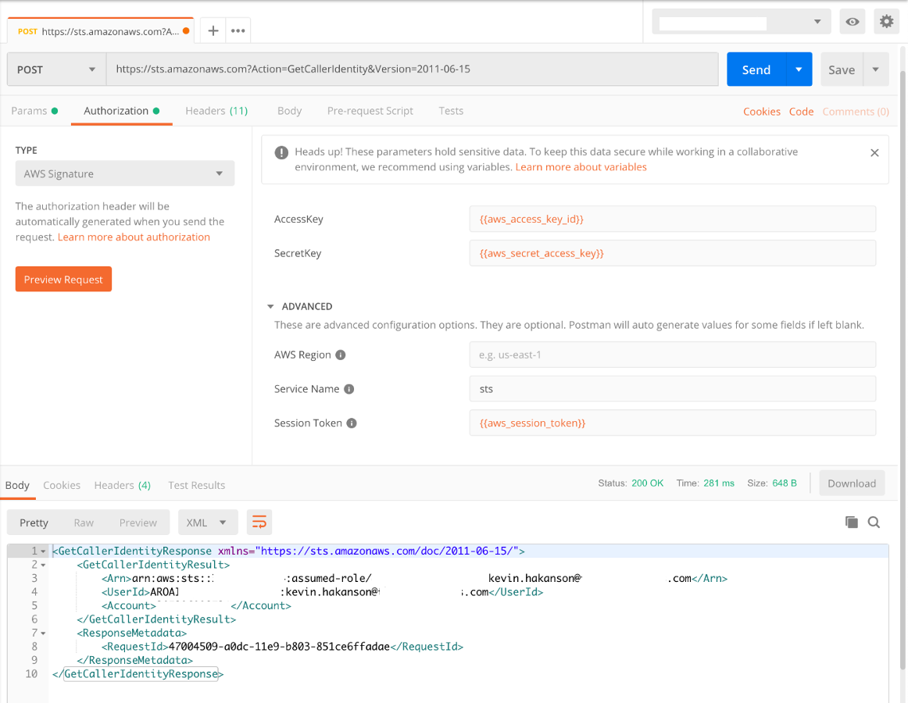
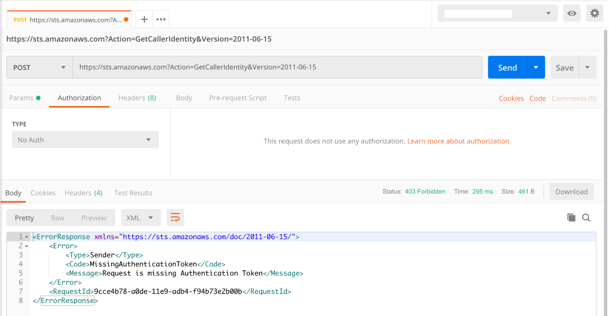

The other day I ran across [Use Postman to Call a REST API - Amazon API Gateway](https://docs.aws.amazon.com/apigateway/latest/developerguide/how-to-use-postman-to-call-api.html), which highlighted that Postman can generate AWS Signatures for authorization (see [Authorization | Postman Learning Center](https://learning.getpostman.com/docs/postman/sending_api_requests/authorization#amazon-web-services-aws-authentication)).  When I wrote [AWS Chalice, Amazon API Gateway, and AWS IAM Authorization](../2017-08-15-aws-chalice-amazon-api-gateway-and-aws-iam-authorization), I used the [jmenga/requests-aws-sign](https://github.com/jmenga/requests-aws-sign) library inside my Python code to sign my HTTP requests, but this would be an interesting way to be more interactive.

I used [aws cli configure](https://docs.aws.amazon.com/cli/latest/reference/configure/) to get the values out of `~/.aws/credentials`

```console
$ aws configure get aws_access_key_id
[redacted]
$ aws configure get aws_secret_access_key
[redacted]
$ aws configure get aws_session_token
[redacted]
```

I created a [Postman environment](https://learning.getpostman.com/docs/postman/environments_and_globals/intro_to_environments_and_globals) and manually added these values as variables.  I was able to export this to a JSON format that can also be used for import.  I plan on looking at a way to script the creation of this file and avoid the extra cutting/pasting when my session credentials expire or maybe there is a way [Pre-request scripts](https://learning.getpostman.com/docs/postman/scripts/pre_request_scripts) can fetch them.

```json
{
     "id": "638759e0-bc49-420d-be3a-794ff7c8a08b",
     "name": "aws",
     "values": [
          {
               "key": "aws_access_key_id",
               "value": "[redacted]",
               "enabled": true
          },
          {
               "key": "aws_secret_access_key",
               "value": "[redacted]",
               "enabled": true
          },
          {
               "key": "aws_session_token",
               "value": "[redacted]",
               "enabled": true
          }
     ],
     "_postman_variable_scope": "environment",
     "_postman_exported_at": "2019-07-07T17:23:27.037Z",
     "_postman_exported_using": "Postman/7.2.2"
}
```

If I switch the Authorization Type to AWS Signature, I can set the AccessKey, SecretKey, and Session Token to the variables from my environment.  I also set the Service Name to `sts` for my first test, which is my favorite AWS API for testing: [GetCallerIdentity - AWS Security Token Service](https://docs.aws.amazon.com/STS/latest/APIReference/API_GetCallerIdentity.html)



If I switch to "No Auth", you can see the **MissingAuthenticationToken** error.


