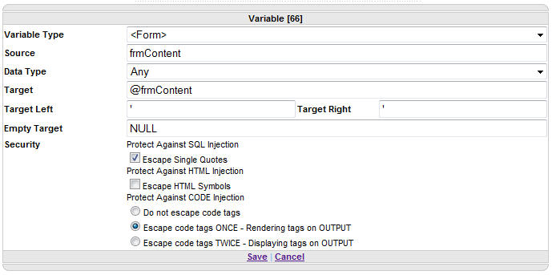

A few months ago, I was reviewing some code that was flagged by Veracode for multiple **[CWE-89](http://cwe.mitre.org/data/definitions/89.html): Improper Neutralization of Special Elements used in an SQL Command ('SQL Injection')** flaws. When working with the development team, they demonstrated that the SQL generation which triggers these flaws is part of [OpenWebStudio](http://www.openwebstudio.com/) (OWS) and is driven by configuration data.  I said that if we can prove we are generating from safe input, I could mitigate, but I wanted an in-depth review of the code paths.

OWS does include the ability to [Protect Against SQL Injection](http://www.openwebstudio.com/topic/Action_Variable.aspx#Protect_Against_SQL_Injection) and even explicitly mentions to **"ALWAYS check the box to protect against SQL Injection"**.  Here is a screenshot from the [Variable](http://www.openwebstudio.com/topic/Action_Variable.aspx) documentation.



Since OWS is open source, I was able to search the code and find that the `FormatQueryVariable` implementation inside [Render.Variable.vb](https://github.com/kevinmschreiner/OpenWebStudio/blob/e4c16a349c33db82e25aa2200353cfff8d01f0cd/Source/Code/r2i.OWS/Engine/Plugins/Renderers/Render.Variable.vb#L1762) works as expected.

```vbnet
  If EscapeQuotes Then
      Value = Value.Replace("'", "''")
      If (Left Is Nothing OrElse Left.Length = 0) AndAlso (Right Is Nothing OrElse Right.Length = 0) Then
          'NO LEFT AND RIGHT ARE PROVIDED, BUT SQL INJECTION IS CHECKED
          Firewall.Firewall(Value, False, Utilities.Firewall.FirewallDirectiveEnum.Any, False)
      End If
  End If
```

The configuration from that Variable UI Dialog above is serialized as JSON data into an XML based Microsoft ResX file.

```xml
<data name="Module.Load" xml:space="preserve">
  <value>
  <!-- OWS JSON configuration -->
  </value>
</data>
```

Inside that JSON configuration string is a block for each of the Variable configurations.  The JSON sample below is representative of the UI Dialog above.  Note that `Protected` is set to `"true"`.

```json
  "ChildActions": [{
      "Index": 66,
      "Level": 0,
      "Parameters": {
          "VariableType": "&lt;Form&gt;",
          "VariableDataType": "Any",
          "Formatters": "",
          "QuerySource": "frmContent",
          "QueryTarget": "@frmContent",
          "QueryTargetLeft": "'",
          "QueryTargetRight": "'",
          "QueryTargetEmpty": "NULL",
          "EscapeListX": "0",
          "Protected": "true",
          "EscapeHTML": "false"
      },
      "ActionType": "Template-Variable",
      "ChildActions": []
  }
```

I had asked the team to write a script to scan all `.ascx.resx` files in the project and verify SQL Protection is being set as expected.  However, when I checked back with them, this was still on the backlog.  I took this as an opportunity to help out and write the code myself.  I usually use python for my utility scripts, but I decided to try out PowerShell for this since it would be more familiar to that .NET based team.

The first thing I wanted to do was initialize some counters and recursively find all the `*.ascx.resx` files.  Since I kept seeing examples using `|` in my google results, I read up on [How Pipelines Work](https://docs.microsoft.com/en-us/powershell/module/microsoft.powershell.core/about/about_pipelines?view=powershell-6#how-pipelines-work) in PowerShell, including the [`ForEach-Object`](https://docs.microsoft.com/en-us/powershell/module/microsoft.powershell.core/about/about_foreach?view=powershell-6) function and the [`$_`](https://docs.microsoft.com/en-us/powershell/module/microsoft.powershell.core/about/about_automatic_variables?view=powershell-6#_) automatic variable.

```powershell
$FileCount = 0
$IndexCount = 0
$FilePathLength = (Get-Location).Path.Length + 1

Get-ChildItem *.ascx.resx -Recurse | ForEach-Object {
  $CurrentFile = $_.FullName.substring($FilePathLength)
  [String[]] $FileMessages = @()
  
  # continued below
```

I used [`Select-Xml`](https://docs.microsoft.com/en-us/powershell/module/microsoft.powershell.utility/select-xml?view=powershell-6) with an `XPath` selector of `//data[@name='Module.Load']/value`, eventually converting the JSON string value into a `PSCustomObject` using [`ConvertFrom-Json`](https://docs.microsoft.com/en-us/powershell/module/microsoft.powershell.utility/convertfrom-json?view=powershell-6).  I then iterated over the `ChildActions` and called a `ScanChildActions` function I created to return an array of any violations.

```powershell
  $obj = Select-Xml -Path $_.FullName -XPath "//data[@name='Module.Load']/value" |
  ForEach-Object {$_.node.InnerXML} |
  ConvertFrom-Json

  $obj.messageItems | ForEach-Object {
    $_.ChildActions | ForEach-Object {
      $FileMessages = ScanChildActions $_ $FileMessages
    }
  }
  
  # continued below
```

The `ChildActions` function is a recursive scan that looks for any `ActionType` of `Template-Variable` and inspects the `Protected` parameter.  If `"false"`, it appends an error message with the `️Index` value as the key for finding the offending `Variable` later.

```powershell
function ScanChildActions($ChildActions, [String[]]$ErrorMessages) {
  $ChildActions | ForEach-Object {
    if ($_.ActionType -eq "Template-Variable") {
      if ($_.Parameters.Protected -eq "false") {
        $message = "️Index=$($_.Index)  Protected=false"
        $ErrorMessages += $message
      }
    }

    $ErrorMessages = [String[]](ScanChildActions $_.ChildActions $ErrorMessages)
  }

  return $ErrorMessages
}
```

With all the error messages gathered for the file, it was time to output the results and increment `$FileCount` / `$IndexCount` and output either a success (✅) or failure (❌) line for that filename.

```powershell
  # ... continued from above

  if ($FileMessages.length -eq 0) {
    Write-Output "✅  $($CurrentFile)"

  } else {
    $script:FileCount++
    $script:IndexCount += $FileMessages.Length

    Write-Output "❌  $($CurrentFile)"
    $FileMessages | ForEach-Object { Write-Output "️  ☒ $($_)" }
  }
}
```

Because I intended for this to be run as part of the build, I made sure to return a non-zero exit code so this script could be used to fail either the build or a pre-commit hook or whatever worked for the team's development flow.

```powershell
Write-Output "$($FileCount) files had $($IndexCount) instances of Variable SQL Injection"
if ($FileCount -gt 0) {
  exit -1
}
exit 0
```

I am early in my PowerShell script development journey, so there are likely improvements I could make to this code.  However, since my goal was to improve security through automation, I feel good about the solution.
