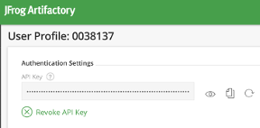

I received early adopter access to our [JFrog Artifactory](https://jfrog.com/artifactory/) instances located at [https://tr1.jfrog.io](https://tr1.jfrog.io/).  After you log in via SSO you are redirected to [https://tr1.jfrog.io/tr1/webapp/#/home](https://tr1.jfrog.io/tr1/webapp/#/home) (note that `/tr1/` path segment as this is needed for API URLs).  I wanted to try CLI access so I started with a simple unauthenticated "[ping](https://www.jfrog.com/confluence/display/RTF/Artifactory+REST+API#ArtifactoryRESTAPI-SystemHealthPing)" using `curl` against the REST API using [\-s](https://curl.haxx.se/docs/manpage.html#-s) for "silent mode" and [\-i](https://curl.haxx.se/docs/manpage.html#-i) to include HTTP response header is output, but limit to the first line by piping through `head`.

```console
$ curl -s -i https://tr1.jfrog.io/tr1/api/system/ping | head -n 1
HTTP/1.1 200 OK
```

Success. Let's try some negative testing of my user but with an invalid API key.

```console
$ curl -s -i -u "0038137:INVALID_APIKEY" \
https://tr1.jfrog.io/tr1/api/system/ping | head -n 1
HTTP/1.1 401 Unauthorized
```

Now let's grab my API key and try again.



```console
$ curl -s -i -u "0038137:REDACTED_APIKEY" \
https://tr1.jfrog.io/tr1/api/system/ping | head -n 1
HTTP/1.1 200 OK
```

Notice that I've replaced my real API Key with REDACTED\_APIKEY above.  Using the real API Key works, but it is long, hard to type, and using it that way exposes it to someone looking in my `.bash_history` file.

Let's switch to using the [JFrog CLI](https://www.jfrog.com/confluence/display/CLI/JFrog+CLI) and see how that works with my API Key.  Visit the documentation site for full install instructions, including auto-completion scripts.  This CLI works with multiple JFrog products, and `rt` is the target argument for JFrog Artifactory.  The [config](https://www.jfrog.com/confluence/display/CLI/CLI+for+JFrog+Artifactory#CLIforJFrogArtifactory-Configuration) command will create a `~/.jfrog/jfrog-cli.conf` file that is used for other CLI commands.  For the command history reason above, I recommend not to use the `--apikey` parameter and enter your API Key in interactive mode.

```console
$ jfrog --version
jfrog version 1.27.0

$ jfrog rt config --url https://tr1.jfrog.io/tr1/ --user 0038137
Artifactory server ID: tr1
Access token (Leave blank for username and password/API key): 
Password/API key: 
[Info] Encrypting password...
```

Similar to the REST API, the JFrog CLI supports a [ping command](https://www.jfrog.com/confluence/display/CLI/CLI+for+JFrog+Artifactory#CLIforJFrogArtifactory-VerifyingArtifactoryisAccessible) to verify that Artifactory is accessible.

```console
$ jfrog rt ping
OK
```

Taking a peek at the config file, you can see the API Key was stored in the "password" field during the interactive flow.  

```console
$ cat ~/.jfrog/jfrog-cli.conf
{
  "artifactory": [
    {
      "url": "https://tr1.jfrog.io/tr1/",
      "user": "0038137",
      "password": "REDACTED_APIKEY",
      "serverId": "tr1",
      "isDefault": true
    }
  ],
  "Version": "1"
}
```

There is also a [Running cUrl](https://www.jfrog.com/confluence/display/CLI/CLI+for+JFrog+Artifactory#CLIforJFrogArtifactory-RunningcUrl) feature to invoke REST APIs not available in the JFrog CLI.  That takes the same arguments as native curl but uses a shortened REST API path and automatically includes login credentials.

```console
$ jfrog rt curl -X GET /api/system/ping
OK
```

If you really love complicated command lines, you could inject your API Key from the config file using `jq` and still execute `curl` yourself.  Have fun!

```console
$ jq -r ".artifactory[0].password" ~/.jfrog/jfrog-cli.conf
REDACTED_APIKEY

$ curl -s -i \
-u "0038137:$(jq -r ".artifactory[0].password" ~/.jfrog/jfrog-cli.conf)" \
https://tr1.jfrog.io/tr1/api/system/ping | head -n 1
HTTP/1.1 200 OK
```

Now let's trying something that is unique to my user by calling the REST API to [Get API Key](https://www.jfrog.com/confluence/display/RTF/Artifactory+REST+API#ArtifactoryRESTAPI-GetAPIKey).  This should echo back the same REDACTED\_APIKEY I have in my config file.

```console
$ jfrog rt curl -X GET /api/security/apiKey
{"apiKey":"REDACTED_APIKEY"}
```

For my CI/CD pipelines, I don't really want my personal API Key being used.  Luckily, JFrog also supports [Access Tokens](https://www.jfrog.com/confluence/display/ACC/Access+Tokens) "as a flexible means of authentication with a wide range of capabilities" including:

> * **User and non-user authentication**  
>  The case for authenticating users is clear, however access tokens can also be assigned to non-user entities such as CI server jobs.
> * **Flexible scope**  
>  By assigning Groups to tokens, you can control the level of access they provide.

Let's create an access token that is valid for the next 90 seconds and then configure a `tr1token` entry in our config file.

```console
$ jfrog rt curl -X POST /api/security/token \
-d "username=0038137" \
-d "scope=member-of-groups:readers" \
-d "expires_in=90"
{
  "scope" : "member-of-groups:readers api:*",
  "access_token" : "REDACTED_TOKEN",
  "expires_in" : 90,
  "token_type" : "Bearer"
}

$ jfrog rt config --url https://tr1.jfrog.io/tr1/ --user 0038137
Artifactory server ID [tr1]: tr1token
Access token (Leave blank for username and password/API key): 
```

Quickly use the token with a ping command specifying the `tr1token` config, then wait for 90 seconds for the token to expire and execute another ping command.

```console
$ jfrog rt ping --server-id tr1token
OK

$ echo "wait 90 seconds"
wait 90 seconds

$ jfrog rt ping --server-id tr1token
[Error] Artifactory response: 401 Unauthorized
{
  "errors": [
    {
      "status": 401,
      "message": "Token failed verification: expired"
    }
  ]
}
```

When you inspect the JWT payload data from that token, you can see the `exp` time.

```json
{
  "sub": "jfrt@01dc27m2makwbg11a8k5sr05z2/users/0038137",
  "scp": "member-of-groups:readers api:*",
  "aud": "jfrt@01dc27m2makwbg11a8k5sr05z2",
  "iss": "jfrt@01dc27m2makwbg11a8k5sr05z2",
  "exp": 1566405855,
  "iat": 1566405765,
  "jti": "47e178d6-0263-4c13-969c-087f79a07a02"
}
```

Unfortunately, this still is an Access Token tied to my user account.  There is a way for Admin Users to create Access Token for "non-user entities such as CI server jobs" (mentioned above), so I need to work with our JFrog Artifactory admin to figure out the best way to move forward.
