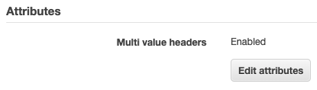

I finally took the time experiment with the ability of an AWS Application Load Balancer (ALB) to [target a Lambda function](https://docs.aws.amazon.com/en_pv/elasticloadbalancing/latest/application/lambda-functions.html) for HTTP requests.

I decided to start with some Python code based on the [whatismyip](https://github.com/aws/elastic-load-balancing-tools/tree/master/application-load-balancer-serverless-app/whatismyip) example.  I mapped the `/whatismyip` path to return the caller's IP address and defaulted other paths to returning the event as JSON.

```python
import json

def lambda_handler(event, context):

  response = {
    "statusCode": 200,
    "headers": {
      "Content-Type": "text/plain;"
    },
    "isBase64Encoded": False
  }

  if event['path'] == '/whatismyip':
    sourceip_list = event['headers']['x-forwarded-for'].split(',')
    if sourceip_list:
      sourceip = str(sourceip_list[0])
      response['body']=sourceip
    else:
      response['body']='?.?.?.?'
    return response

  response['body'] = json.dumps(event, indent=2)
  
  return response
```

The `/whatismyip` path returns my IP as expected.

```
http://lambdatarget-test-1584240650.us-east-1.elb.amazonaws.com/whatismyip
198.179.137.209
```

Executing against the `/browser` path reflects the event structure.

```json
{
  "requestContext": {
    "elb": {
      "targetGroupArn": "arn:aws:elasticloadbalancing:us-east-1:123456789012:targetgroup/whatismyip-target/61f1fdd113474a4b"
    }
  },
  "httpMethod": "GET",
  "path": "/browser",
  "queryStringParameters": {},
  "headers": {
    "accept": "text/html,application/xhtml+xml,application/xml;q=0.9,image/webp,image/apng,*/*;q=0.8,application/signed-exchange;v=b3",
    "accept-encoding": "gzip, deflate",
    "accept-language": "en-US,en;q=0.9",
    "connection": "keep-alive",
    "dnt": "1",
    "host": "lambdatarget-test-1584240650.us-east-1.elb.amazonaws.com",
    "upgrade-insecure-requests": "1",
    "user-agent": "Mozilla/5.0 (Macintosh; Intel Mac OS X 10_14_6) AppleWebKit/537.36 (KHTML, like Gecko) Chrome/78.0.3904.70 Safari/537.36,
    "x-amzn-trace-id": "Root=1-5db31bde-f102927a851f3aaa17ebd23a",
    "x-forwarded-for": "198.179.137.209",
    "x-forwarded-port": "80",
    "x-forwarded-proto": "http"
  },
  "body": "",
  "isBase64Encoded": false
}
```

Next, I enabled [multi-value headers](https://docs.aws.amazon.com/en_pv/elasticloadbalancing/latest/application/lambda-functions.html#multi-value-headers) to see how that changes the JSON structure.



I hit `/whatismyip` again but received **502 Bad Gateway** instead of an IP address.  Looking at the CloudWatch logs, I found this `KeyError` related to `'headers'`.

```console
[ERROR] KeyError: 'headers'
Traceback (most recent call last):
  File "/var/task/lambda_function.py", line 16, in lambda_handler
    sourceip_list = event['headers']['x-forwarded-for'].split(',')
```

My problem is that I didn't read the documentation about field names being different.

> The names of the fields used for headers differ depending on whether you enable multi-value headers for the target group. You must use multiValueHeaders if you have enabled multi-value headers and headers otherwise.

I instead needed to check `event['multiValueHeaders']['x-forwarded-for'][0]` for the IP address.  However, after that change, things still didn't work as expected: The IP didn't appear in the browser window but was download as a file.  When I used Chrome Developer Tools to inspect the HTTP Response Headers, I saw that `Content-Type` was `application/octet-stream` and not the `text/plain` required.

```http
HTTP/1.1 200 OK
Server: awselb/2.0
Date: Fri, 25 Oct 2019 20:00:04 GMT
Content-Type: application/octet-stream
Content-Length: 15
Connection: keep-alive
```

When multi-value headers are enabled, it affects **both** the Request and Response headers structures.  I need to use `multiValueHeaders` instead of `headers` and set `Content-Type` to the string array `["text/plain;"]`

```python
  response = {
    # ...
    "multiValueHeaders": {
      "Content-Type": ["text/plain;"]
    },
    # ...
  }
```

**Note:** This behavior is different that a similar feature of API Gateway. According to the [Support for multi-value parameters in Amazon API Gateway](https://aws.amazon.com/blogs/compute/support-for-multi-value-parameters-in-amazon-api-gateway/) blog post:

> You can also pass the header key along with the multiValueHeaders key. In that case, API Gateway merges the multiValueHeaders and headers maps while processing the integration response into a single Map<String, List<String>> value. If the same key-value pair is sent in both, it isn’t duplicated.

Enabling multi-value headers in AWS ALB also affects the query string event structure.  Calling `/browser?a=1&a=2` when enabled produces an event that contains an array of values under `multiValueQueryStringParameters`:

```json
  "path": "/browser",
  "multiValueQueryStringParameters": {
    "a": [
      "1",
      "2"
    ]
  },
  "multiValueHeaders": {
```

Calling `/browser?a=1&a=2` when not enabled yields only the last value or `a` under the `queryStringParameters` key.

```json
  "path": "/browser",
  "queryStringParameters": {
    "a": "2"
  },
  "headers": {
```

For a production workload, I would probably look to a Python web framework to abstract these details for me.  I was hoping [AWS Chalice](https://chalice.readthedocs.io/en/latest/) would work, but as of now, it only supports "Amazon API Gateway and AWS Lambda" and not AWS ALBs.  Maybe it's time to open a GitHub issue on [aws/chalice](https://github.com/aws/chalice) and ask about the roadmap?
