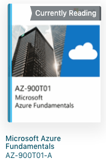
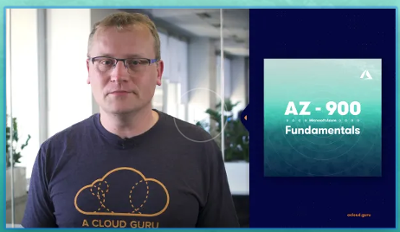
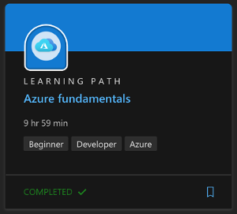

Since February 2019, I have been spending time in Microsoft Azure, primarily related to a "move and improve" project for a ".NET monolith" with heavy dependencies on SQL Server.  Through various proofs-of-concept and architecture design sessions with Microsoft, I felt I had a good baseline set of knowledge of Azure.   So, when I learned there was going to be an onsite class for AZ-900 Microsoft Azure Fundamentals on November 18th, I signed up to round out my knowledge and prepare for the certification exam.

That classroom course had an onsite instructor that reviewed a presentation deck, led the group through some discussions, and asked us some knowledge check questions.  Just prior to the class day, I received a link to course material on Skillpipe which included videos, narrative sections, and sample questions.

I also received a free voucher to take the exam. The instructor mentioned the best way to study was to review the Skillpipe content three days after the class, then do a quick "cram" session on the morning of the exam.

Since I also have access to A Cloud Guru (and love watching streaming video), I went through many of the sections of [AZ-900 Microsoft Azure Fundamentals 2020](https://acloud.guru/learn/az-900-microsoft-azure-fundamentals) to fill in my knowledge gaps and take the section quizzes.  For the more boring sections, step up the playback speed to 1.5x and that will force your brain to pay better attention.

Since I also love collecting virtual XP, I visited the Microsoft Learn site to review the [Azure fundamentals](https://docs.microsoft.com/en-us/learn/paths/azure-fundamentals/) learning path.  I didn't spend the 9 hours and 59 minutes suggested but instead skimmed the text and took the quizzes.  

> Once you complete this learning path, you will have the necessary knowledge to take the [AZ900 Microsoft Azure Fundamentals Exam](https://www.microsoft.com/learning/exam-AZ-900.aspx).

Pluralsight didn't have an AZ-900 course, but if you have access to LinkedIn Learning (maybe through an MSDN offer), they have a [Prepare for Azure Fundamentals Certification (AZ-900)](https://www.linkedin.com/learning/paths/prepare-for-azure-fundamentals-certification-az-900) learning path as well. O'Reilly Learning (a.k.a Safari Books Online) also has both a book ([Exam Ref AZ-900: Microsoft Azure Fundamentals, First Edition](https://learning.oreilly.com/library/view/exam-ref-az-900/9780135732199/)) and video ([Microsoft AZ-900 Certification Course: Azure Fundamentals](https://learning.oreilly.com/videos/microsoft-az-900-certification/10009AZ900454545)) resource.

I passed the exam on November 26 and have the [badge](https://www.youracclaim.com/badges/a97b0278-c588-4711-9c03-e869ad9bb60e/linked_in) to prove it.

I won't share my score but I did exceeding well on Understand Cloud Concepts, Understand Core Azure Services, and Understand Security, Privacy, Compliance, and Trust.  I also did embarrassingly horrible on Understand Azure Pricing and Support.  I attribute this to the fact I had spent my time on solutions architecture but leveraged efforts from the Cloud Center of Excellence related to account / subscription setup.  For those of you with similar backstories, I recommend doubling-down on studying for that Pricing and Support section.

Overall, I thought this was a valuable set of knowledge and would agree with any recommendation that passing this should be a baseline requirement for those building solutions in Azure.