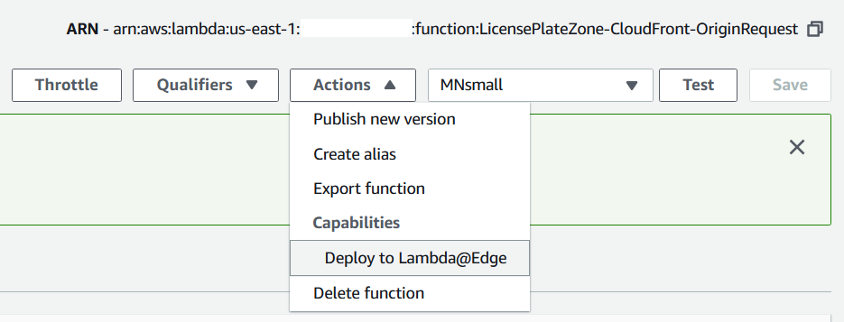

One of my original Lambda@Edge functions was still running on an old Node.js runtime, which I needed to update.  That function dynamically generated images of a United States map with various states shaded based on the filename.  

`https://redacted.cloudfront.net/license-plate-zone/dynamic/usmap.MN.small.jpg`


This image was created from a base SVG, which was parsed and the `fill` color set for each state.  This was subsequently converted into either a JPEG or PNG.  When I first authored this function, I used the X-Ray subsegment functionality to understand the duration of each of these steps.

```javascript
    if (AWSXRay) {
        const subsegment = AWSXRay.getSegment().addNewSubsegment('generateSVG');
    }
```

However, after updating the code and trying to "Deploy to Lambda@Edge"...



...I saw this "X-Ray is not supported" error message:


Sure enough, when I look at the [Lambda Function Supported Runtimes and Configuration ](https://docs.aws.amazon.com/AmazonCloudFront/latest/DeveloperGuide/lambda-requirements-limits.html#lambda-requirements-lambda-function-configuration) I see this lack of X-Ray support explicitly listed.

> * AWS X-Ray is not supported.

How was it working for me before?  What had I done differently, or was this a feature which has been disabled for new deployments?  Instead of using the AWS Console, I used the AWS CLI [publish-version](https://docs.aws.amazon.com/cli/latest/reference/lambda/publish-version.html?highlight=edge) command.

```console
$ aws lambda publish-version --function-name LicensePlateZone-CloudFront-OriginRequest
```

I then used the AWS Console to update the Behavior on this CloudFront Distribution to specify the version as `:2`.


In CloudFront Monitoring, when you look at the "Lambda@edge function metrics" section, it indicates in which regions the functions are invoked.

> Lambda@Edge functions are triggered in Regions close to your end users.
> 
> The metrics on this page provide an aggregate view of different Regions in which the Lambda@Edge function executed.


AWS X-Ray is supported in Ohio (us-east-2) where this executed...


..and my code dynamically detects X-Ray support and will `console.log` the `awsRequestId` to assist my future debugging.

```javascript
    if (process.env.AWS_XRAY_DAEMON_ADDRESS) {
        const segmentName = process.env._HANDLER || 'index.handler';
        subsegment = AWSXRay.getSegment().addNewSubsegment(segmentName);
        subsegment.addMetadata('event', event);
        subsegment.addMetadata('context', context);
        if (context.awsRequestId) {
            subsegment.addAnnotation('awsRequestId', context.awsRequestId);
            console.log(`AWS X-Ray filter:  Annotation.awsRequestId = "${context.awsRequestId}"`);
        }
```

When I go to `CloudWatch > Log Groups > /aws/lambda/us-east-1.LicensePlateZone-CloudFront-OriginRequest` in Ohio, I can just copy that X-Ray filter expression...

```
2020-01-20T04:25:45.932Z	c80d37f9-1805-4233-8ca3-b0f86d73cd02	INFO	AWS X-Ray filter:  Annotation.awsRequestId = "c80d37f9-1805-4233-8ca3-b0f86d73cd02"
```

...and use to find the `Trace`.  Here is the `Timeline` for that request with a timing breakdown for `generateSVG` and `generateImage`.


Also, some of the `Raw data` JSON for that `Trace`, which shows the `request_id` and `resource_arn`.

```json
    "Document": {
        "id": "48105c4f14533917",
        "name": "us-east-1.LicensePlateZone-CloudFront-OriginRequest",
        "start_time": 1579494345.905,
        "end_time": 1579494346.164,
        "http": {
            "response": {
                "status": 200
            }
        },
        "aws": {
            "request_id": "c80d37f9-1805-4233-8ca3-b0f86d73cd02"
        },
        "trace_id": "1-5e252bc9-e3c78f382891b2ccf6c99a18",
        "origin": "AWS::Lambda",
        "resource_arn": "arn:aws:lambda:us-east-2:0123456789012:function:us-east-1.LicensePlateZone-CloudFront-OriginRequest:2"
    },
```

This shows that when CloudFront invokes a Lambda@Edge function in an AWS Region that supports AWS X-Ray, it works as expected.  However, this still might not mean it is "supported" by AWS, so use at your own risk.