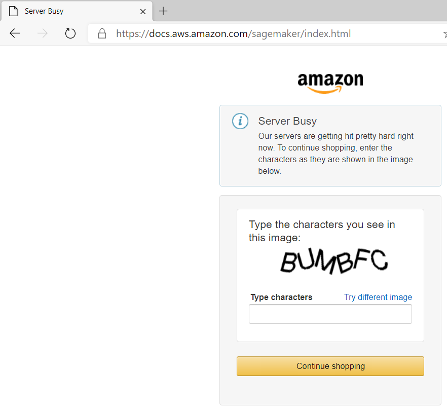
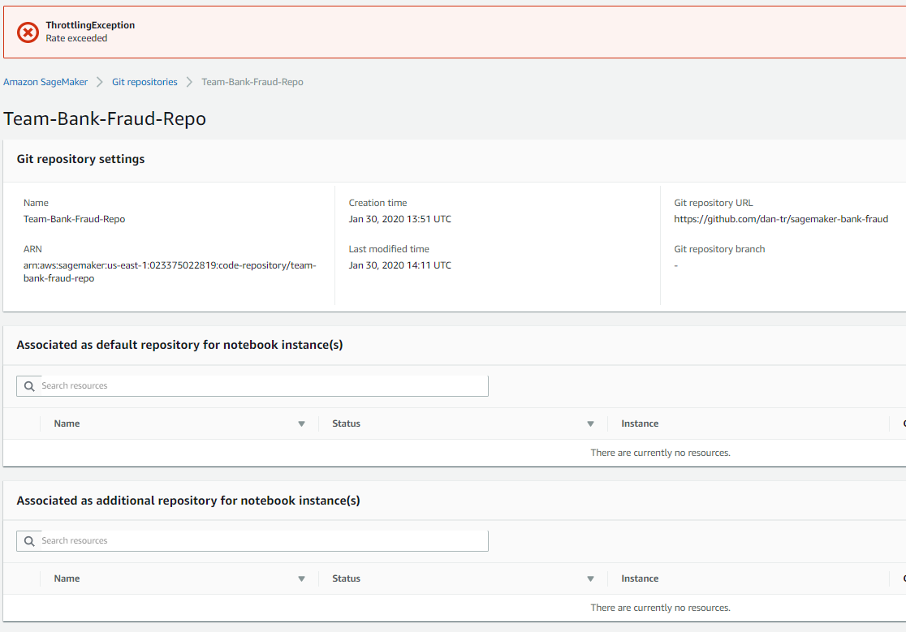
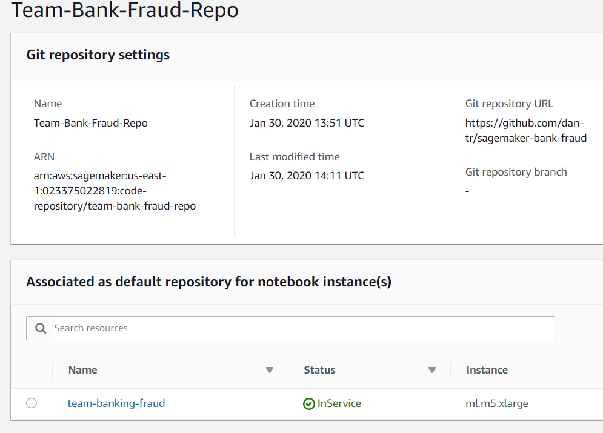

Last week, I attended an **Architecting for Machine Learning on AWS** event at their Minneapolis office along with about 40 people.

> This three-day technical workshop is designed to provide architects and developers hands-on training for designing production machine learning and deep learning systems using Amazon SageMaker. AWS Solutions Architects will provide training through lecture and hands-on labs with Amazon SageMaker and go over proven approaches to successfully train, and deploy machine learning models for enterprise applications. Attendees will design and implement a completely new machine learning solution using Amazon SageMaker and their own Python code.

As a group, we walked through labs and exercises using credentials provisioned into an AWS owned account.  The instructor warned us that we would hit "throtting" exceptions when we all all tried to create resources at the same time.  However, I did not expect to see errors when trying to view documenation.

A couple of observations related to that screen:
* Shouldn't this be "static HTML" or something highly cachable and served from CloudFront?
* The error message mentions "to continue shopping" indicating it is generic for all of Amazon.
* Suprissing that so few people hitting a documentation page from inside an AWS network would trigger this.

However, I can understand this isn't a page that often displays for legitmate users.  The next Amazon Sagemaker example is more bothersome because of the implication of a partially rendered UI.

Above you clearly see the `ThrottlingException Rate exceeded` error at the top as well as a `There are currently no resources` message.  Reloading the page later, you can see there are indeed reources listed.

This UI architecture failed the user when it couldn't load the assocated resouces.  The UI should have put error messages into the same areas of the screen where the data would load, or have started with a `Loading resources...` message and only replacing with `There are currently no resources` if that is a true fact.