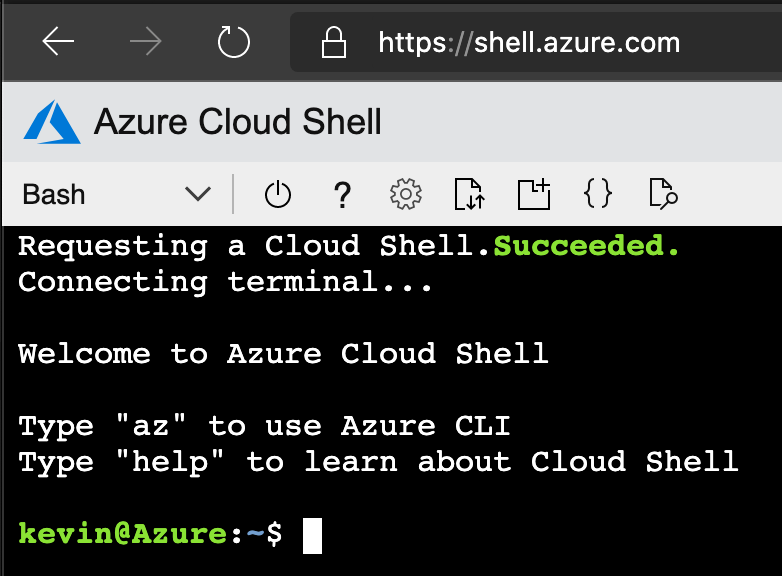
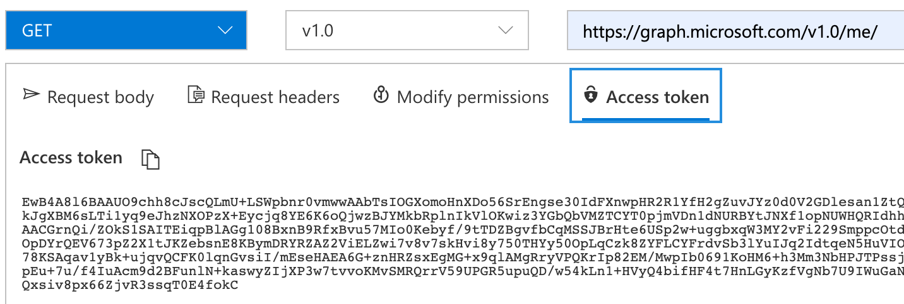
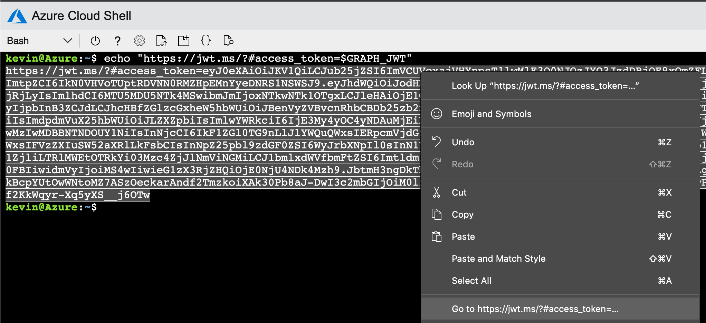

When I'm first exploring a new API, it is comfortable to use a GUI based API explorer tool.  For the Microsoft Graph API, this is the Graph Explorer and a tool I enjoy working with.  Try it out with this direct link which will query [https://graph.microsoft.com/v1.0/me/](https://developer.microsoft.com/en-US/graph/graph-explorer?request=me&method=GET&version=v1.0&GraphUrl=https://graph.microsoft.com&requestBody=dW5kZWZpbmVk) and get a response similar to:

```json
{
    "@odata.context": "https://graph.microsoft.com/v1.0/$metadata#users/$entity",
    "businessPhones": [],
    "displayName": "Kevin Hakanson",
    "givenName": "Kevin",
    "jobTitle": null,
    "mail": "kevin.hakanson@example.com",
    "mobilePhone": null,
    "officeLocation": null,
    "preferredLanguage": null,
    "surname": "Hakanson",
    "userPrincipalName": "kevin.hakanson@example.com",
    "id": "11112222-3333-4444-5555-666677778888"
}
```

Other times I want to explore an API using the command line, since it is easier for me to document my research than using browser screenshots.  I opened up [Azure Cloud Shell](https://shell.azure.com/) ...


...and gave `curl` a try:

```console
kevin@Azure:~$ curl https://graph.microsoft.com/v1.0/me/
{
  "error": {
    "code": "InvalidAuthenticationToken",
    "message": "Access token is empty.",
    "innerError": {
      "request-id": "613cf582-fd4f-4c28-8504-063e78d5334e",
      "date": "2020-05-27T14:01:22"
    }
  }
}
```

This error makes sense, because without an access token, how would it know who `/me/` was?  Using browser DevTools to look at the outgoing HTTP request from Graph Explorer, I see it includes an Authorization header with a Bearer token.

```http
GET /v1.0/me/ HTTP/1.1
Host: graph.microsoft.com
SdkVersion: GraphExplorer/4.0, graph-js/2.0.0 (featureUsage=6)
Authorization: Bearer [redacted]
```



How can I get a token without having to cut/paste?  Luckily, one can [acquire an access token in Cloud Shell](https://docs.microsoft.com/en-us/azure/cloud-shell/msi-authorization#acquire-access-token-in-cloud-shell) by using the `$MSI_ENDPOINT`. I pipe through [jq](https://stedolan.github.io/jq/) for formatting and use [--silent](https://curl.haxx.se/docs/manpage.html#-s) to not have the progress meter get in my output.

```console
kevin@Azure:~$ curl $MSI_ENDPOINT -d "resource"="https://graph.microsoft.com/" --header "metadata: true" --silent | jq
{
  "access_token": "[redacted]",
  "refresh_token": "",
  "expires_in": "3851",
  "expires_on": "1587590674",
  "not_before": "1587586823",
  "resource": "https://graph.microsoft.com/",
  "token_type": "Bearer"
}
```
That worked great for display, but now to save it as the `$GRAPH_JWT` environment variable for later use.  I'll also generate a link to the [jwt.ms](https://jwt.ms/) website to decode the token and inspect the claims.

```console
kevin@Azure:~$ export GRAPH_JWT=`curl $MSI_ENDPOINT --data "resource=https://graph.microsoft.com/" --header "metadata: true" --silent | jq .access_token -r`

kevin@Azure:~$ echo "https://jwt.ms/?#access_token=$GRAPH_JWT"
```



Since I am submitting the request to `/me/`, you would expect the data values to match.  However, the JWT claims of "name", "oid", and "upn" don't exact the keys of "displayName", "id", and "userPrincipalName from the Graph API JSON.  Here is a subset of the JWT claims:

```json
  "aud": "https://graph.microsoft.com/",

  "app_displayname": "AzurePortal Console App",

  "name": "Kevin Hakanson",
  "oid": "11112222-3333-4444-5555-666677778888",
  "upn": "kevin.hakanson@example.com",
```

Let's run that `curl` request using the `$GRAPH_JWT` as the Bearer token in our Authorization header:

```console
kevin@Azure:~$ curl https://graph.microsoft.com/v1.0/me/ --header "Authorization: Bearer $GRAPH_JWT" --silent | jq
{
  "@odata.context": "https://graph.microsoft.com/v1.0/$metadata#users/$entity",
  "businessPhones": [],
  "displayName": "Kevin Hakanson",
  "givenName": "Kevin",
  "jobTitle": null,
  "mail": "kevin.hakanson@example.com",
  "mobilePhone": null,
  "officeLocation": null,
  "preferredLanguage": null,
  "surname": "Hakanson",
  "userPrincipalName": "kevin.hakanson@example.com",
  "id": "11112222-3333-4444-5555-666677778888"
}
```

There's a lot of `null` value fields in that response I want to ignore, so let's add an OData `$select` to the URL.  In the examples above that included `$MSI_ENDPOINT` or `$GRAPH_JWT`, the `$` indicated an environment variable, but the `$select` below is a literal string so we need to escape the `$` as `\$` for it to work correctly.

```console
kevin@Azure:~$ curl "https://graph.microsoft.com/v1.0/me/?\$select=id,userPrincipalName,displayName" --header "Authorization: Bearer $GRAPH_JWT" --silent | jq
{
  "@odata.context": "https://graph.microsoft.com/v1.0/$metadata#users(id,userPrincipalName,displayName)/$entity",
  "id": "11112222-3333-4444-5555-666677778888",
  "userPrincipalName": "kevin.hakanson@example.com",
  "displayName": "Kevin Hakanson"
}
```

The Azure CLI includes an [az rest](https://docs.microsoft.com/en-us/cli/azure/reference-index?view=azure-cli-latest#az-rest) command that invokes a request and automatically authenticates using the logged in credentials.  Therefore, there is no need to pass the `$GRAPH_JWT` ourselves.

```console
kevin@Azure:~$ az rest --url "https://graph.microsoft.com/v1.0/me/?\$select=id,userPrincipalName,displayName"
{
  "@odata.context": "https://graph.microsoft.com/v1.0/$metadata#users(id,userPrincipalName,displayName)/$entity",
  "displayName": "Kevin Hakanson",
  "id": "11112222-3333-4444-5555-666677778888",
  "userPrincipalName": "kevin.hakanson@example.com"
}
```

The result is the same, but the JSON fields are in a different order.  Let's redirect the output to a file and compare.  It looks like `az rest` is not preserving the original order and sorting them instead.

```console
kevin@Azure:~$ az rest --url "https://graph.microsoft.com/v1.0/me/?\$select=id,userPrincipalName,displayName" --output-file me.json

kevin@Azure:~$ cat me.json | jq
{
  "@odata.context": "https://graph.microsoft.com/v1.0/$metadata#users(id,userPrincipalName,displayName)/$entity",
  "id": "11112222-3333-4444-5555-666677778888",
  "userPrincipalName": "kevin.hakanson@example.com",
  "displayName": "Kevin Hakanson"
}
```

Note: Each of these Graph API URLs return the same JSON response:
* https://graph.microsoft.com/v1.0/me/
* https://graph.microsoft.com/v1.0/users/11112222-3333-4444-5555-666677778888
* https://graph.microsoft.com/v1.0/users('11112222-3333-4444-5555-666677778888')

The same user data can be fetched using `/directoryObjects` but this response includes an `@odata.type` field with the `#microsoft.graph.user` value.

```console
kevin@Azure:~$ az rest --url https://graph.microsoft.com/v1.0/directoryObjects/11112222-3333-4444-5555-666677778888?\$select=id,userPrincipalName,displayName"
{
  "@odata.context": "https://graph.microsoft.com/v1.0/$metadata#directoryObjects(id,userPrincipalName,displayName)/$entity",
  "@odata.type": "#microsoft.graph.user",
  "displayName": "Kevin Hakanson",
  "id": "11112222-3333-4444-5555-666677778888",
  "userPrincipalName": "kevin.hakanson@example.com"
}
```

Yet another way to get this data is calling `/users` with using a `$filter` of my `id`, but that response is a `value[]` of users.

```console
kevin@Azure:~$ az rest --url "https://graph.microsoft.com/v1.0/users?\$filter=id eq '11112222-3333-4444-5555-666677778888'&\$select=id,userPrincipalName,displayName"
{
  "@odata.context": "https://graph.microsoft.com/v1.0/$metadata#users(id,userPrincipalName,displayName)",
  "value": [
    {
      "displayName": "Kevin Hakanson",
      "id": "11112222-3333-4444-5555-666677778888",
      "userPrincipalName": "kevin.hakanson@example.com"
    }
  ]
}
```

I bet you are sick of `/me/` by now - I know I just want to `curl` up and `rest` after all this exploration.