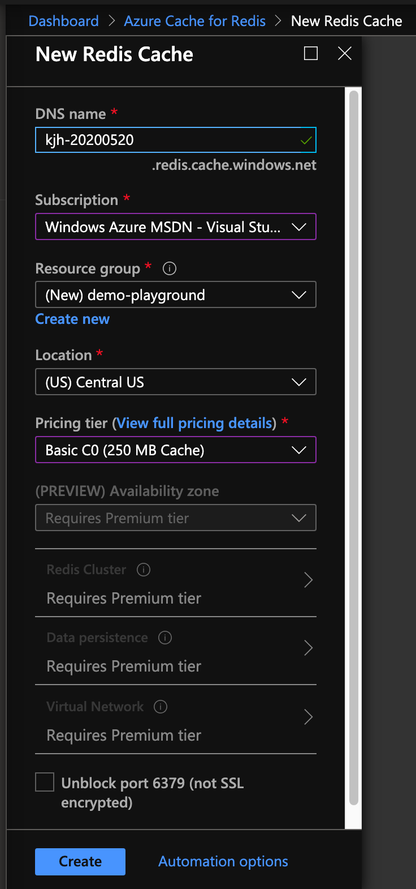

I've blogged about [Redis Security Investigation](/2018-06-22-redis-security-investigation) on AWS before, so thought I would see what the defaults in Azure look like.  It is nice to see a TLS connection is the default.



I wanted to connect to this Redis instance but didn't want to (compile and) install the Redis CLI (and also install `stunnel` for TLS support), so I decided to check out [RedisInsight](https://redislabs.com/redisinsight/), a lightweight multi-platform management GUI for Redis.  I left the password field below blank on the configuration, since I didn't specifically set one up in Azure.


I was glad to see that I could not connect.  It looks like Azure not only sets a password (access token), but they make it long and random.   Additionally, they support two tokens allowing for a controlled password rotation workflow.  I am very impressed here.


After completing that connection in RedisInsight using the a password, I used the integrated CLI to execute a `ping` and `info` command.  I'm including both the partial text output and a screenshot.

```console
Connecting...
Pinging Redis server on kjh-20200520.redis.cache.windows.net:6380... Connected.
Ready to execute commands. 
>> ping
"PONG" 
>> info
# Server 
redis_version:4.0.14
redis_mode:standalone 
os:Windows 
arch_bits:64 
multiplexing_api:winsock_IOCP 
```


Even with a strong password/access token, I don't like leaving my Redis open to the internet.  In order to implement IP restrictions to this Redis instance, I can add firewall rules.


The Azure CLI includes an [az redis](https://docs.microsoft.com/en-us/cli/azure/redis?view=azure-cli-latest) command to manage firewall rules.  However, this is a separate API call from listing information about the Redis instance.

```console
PS /home/kevin> az redis firewall-rules list --resource-group demo-playground --name kjh-20200520
[
  {
    "endIp": "[redacted]",
    "id": "/subscriptions/11111111-1111-4000-11111111111111111/resourceGroups/demo-playground/providers/Microsoft.Cache/Redis/kjh-20200520/firewallRules/HomeIP",
    "name": "kjh-20200520/HomeIP",
    "resourceGroup": "demo-playground",
    "startIp": "[redacted]",
    "type": "Microsoft.Cache/Redis/firewallRules"
  }
]
```

At the time of this blog post, **Redis 6.0.3** is the latest stable version, but the Azure version is **4.0.14** which is from March 2019 and the last release of the 4.x branch according to http://download.redis.io/releases/).  Also, at the time of this blog post, AWS [Supported ElastiCache for Redis Versions](https://docs.aws.amazon.com/AmazonElastiCache/latest/red-ug/supported-engine-versions.html) includes **Redis 5.0.6 (Enhanced)** (from September 2019 where **5.0.9** is latest) and **Redis 4.0.10 (Enhanced)** (from June 2018).