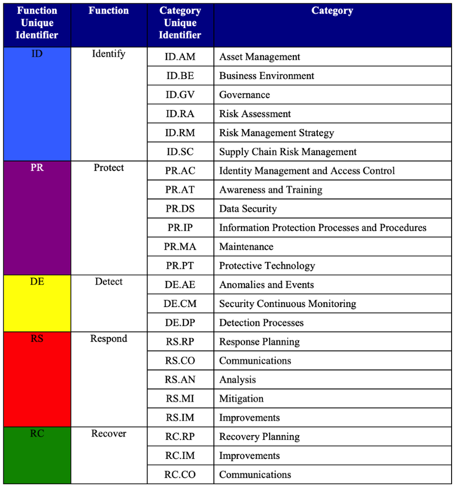

The [NIST Cybersecurity Framework](https://www.nist.gov/cyberframework) (NIST CSF) was created via a collaboration between the United States government and industry as a voluntary framework to promote the protection of critical infrastructure, and is based on existing standards, guidelines, and practices.  The NIST CSF consists of three main components: Core, Implementation Tiers, and Profiles. In this blog, we will explore the Framework Core with the same example we used in [Understanding CIS Controls and Benchmarks](/2020-06-11-understanding-cis-controls-and-benchmarks).

    
[Source: NIST Cybersecurity Framework](https://www.nist.gov/cyberframework)

The **Framework Core** provides a “set of activities to achieve specific cybersecurity outcomes, and references examples of guidance to achieve those outcomes” and is separated into five high level **Functions** (Identify, Protect, Detect, Respond, Recover).  Each function is further divided to 23 **Categories** (see figure below), each of which are assigned an identifier (ID) and are closely tied to needs and activities.  The deepest level of abstraction in the NIST CSF are the supporting 108 **Subcategories**, which are associated with multiple **Informative References** linking back to other standards, guidance, and publications including the CIS Controls (CIS CSC). As with many frameworks, consider the details as illustrative and risk informing and not as exhaustive listing. 

As described in section 2.1 of the (NIST) [Framework for Improving Critical Infrastructure Cybersecurity Version 1.1 Update](https://nvlpubs.nist.gov/nistpubs/CSWP/NIST.CSWP.04162018.pdf):

*   **Identify** **(ID)** – Develop an organizational understanding to manage cybersecurity risk to systems, people, assets, data, and capabilities.
*   **Protect** **(PR)** – Develop and implement appropriate safeguards to ensure delivery of critical services.
*   **Detect** **(DE)** – Develop and implement appropriate activities to identify the occurrence of a cybersecurity event.
*   **Respond** **(RS)** – Develop and implement appropriate activities to take action regarding a detected cybersecurity incident.
*   **Recover** **(RC)** – Develop and implement appropriate activities to maintain plans for resilience and to restore any capabilities or services that were impaired due to a cybersecurity incident.

  
Source: Table 1, [Framework for Improving Critical Infrastructure Cybersecurity](https://nvlpubs.nist.gov/nistpubs/CSWP/NIST.CSWP.04162018.pdf) [Version 1.1](https://nvlpubs.nist.gov/nistpubs/CSWP/NIST.CSWP.04162018.pdf) 

To continue with the Multi\-Factor Authentication (MFA) example from our previous CIS Controls and Benchmarks post, let’s drill into the **Protect (PR)** Function and look at the **PR.AC** Category described by NIST as: 

**Identity Management, Authentication and Access Control (PR.AC)**: Access to physical and logical assets and associated facilities is limited to authorized users, processes, and devices, and is managed consistent with the assessed risk of unauthorized access to authorized activities and transactions. 

This clearly pertains to the identity of users and how they authenticate into systems. Going further down into the **PR.AC-7** subcategory: 

**PR.AC-7**: Users, devices, and other assets are authenticated (e.g., single-factor, multi\-factor) commensurate with the risk of the transaction (e.g., individuals’ security and privacy risks and other organizational risks) 

Additionally, the [Informative References for **PR.AC-7**](https://nvlpubs.nist.gov/nistpubs/CSWP/NIST.CSWP.04162018.pdf#page=37%26zoom=100,92,96) include a reference to **CIS CSC 1, 12, 15, 16.** That list contains **CIS Control 16,** which is **Account Monitoring and Control** and includes subcontrol **16.3 Require Multi-factor Authentication**. However, PR.AC-7 doesn’t seem to mention **CIS Control 4: Controlled Use of Administrative Privileges** and subcontrol **4.5: Use Multi-Factor Authentication for All Administrative Access.** 

Combining NIST CSF together with the CIS Controls, a user with admin access requires MFA according to this set of recommendations.  

*   CIS Controls v7.1 4.5 
*   CIS Controls v7.1 16.3 
*   NIST CSF v1.1 PR.AC-7

---

*Original version appears on the [OpsCompass blog](https://discover.opscompass.com/blog/intro-to-nist-cybersecurity-framework)*