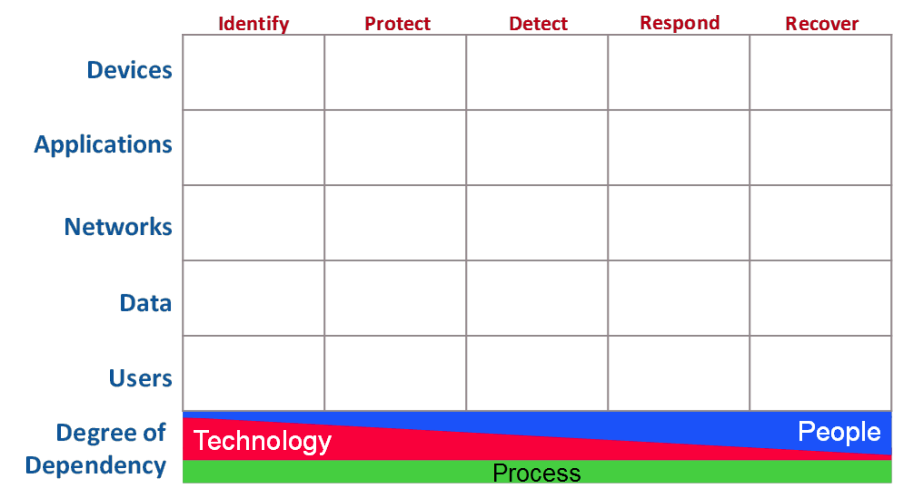
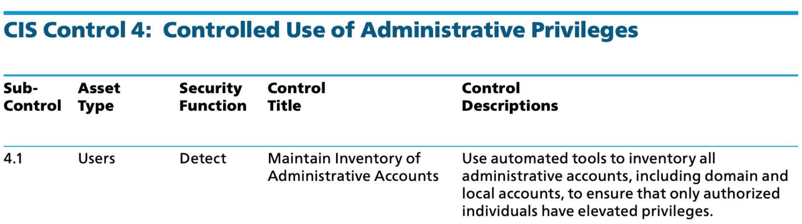

[The OWASP® Foundation](https://owasp.org/) works to improve the security of software through its community-led open source software projects, including the [OWASP Cyber Defense Matrix](https://owasp.org/www-project-cyber-defense-matrix/), a project initially created to help organize security technologies across the cybersecurity vendor marketplace. They address some of the confusion that still exists as a result of both a cybersecurity community that doesn’t use consistent terminology and vendors who use marketecture language based on trendy jargon.

Let’s first take a peek at an empty Cyber Defense Matrix and then dig into the components that define its structure.

Source: [https://owasp.org/www-project-cyber-defense-matrix/](https://owasp.org/www-project-cyber-defense-matrix/)

The raw matrix is structured as a five-by-five grid with the left column labels consisting of Asset Types and the top row labels of Security Functions.  
  
These five high level security functions, described in detail in the [Introduction to the NIST Cybersecurity Framework](/2020-06-26-introduction-to-the-nist-cybersecurity-framework), are listed below for reference: 

* **Identify (ID)** – Develop an organizational understanding to manage cybersecurity risk to systems, people, assets, data, and capabilities.   
* **Protect (PR)** – Develop and implement appropriate safeguards to ensure delivery of critical services.   
* **Detect (DE)** – Develop and implement appropriate activities to identify the occurrence of a cybersecurity event.   
* **Respond (RS)** – Develop and implement appropriate activities to take action regarding a detected cybersecurity incident.   
* **Recover (RC)** – Develop and implement appropriate activities to maintain plans for resilience and to restore any capabilities or services that were impaired due to a cybersecurity incident. 

The **CIS Controls**, in conjunction with the five NIST functions, uses five Asset Types to classify almost every individual CIS Sub-Control. 

* **Devices**   
* **Applications**   
* **Networks**   
* **Data**   
* **Users** 

While the image below is an arbitrary example taken from the CIS Controls v7.1 document, it illustrates how **CIS Sub-Control 4.1: Maintain Inventory of Administrative Accounts** applies to the intersection of the Users asset type and the Detect security function. For a deeper dive on CIS, take a look at our recent blog [Understanding CIS Controls and Benchmarks](/2020-06-11-understanding-cis-controls-and-benchmarks). 

Now let’s use the Cyber Defense Matrix as a tool to organize some data pertaining to security controls. As you review the entire set of [NIST CSF Subcategories](https://nvlpubs.nist.gov/nistpubs/CSWP/NIST.CSWP.04162018.pdf) and [CIS Sub-Controls](https://www.cisecurity.org/white-papers/cis-controls-v7-1-implementation-groups/) totaled by their related security function, **Protect** receives by far the most attention, followed by **Detect** and **Identify**.  
  

*   **Identify** – NIST CSF: **29** / CIS **18** 
*   **Protect** – NIST CSF: **39** / CIS **75** 
*   **Detect** – NIST CSF: **18** / CIS **36** 
*   **Respond** – NIST CSF: **16** / CIS **6** 
*   **Recover** – NIST CSF: **6** / CIS **0**  

Going back to the matrix structure, there is a categorization of the **People / Process / Technology** model represented as a continuum characterizing the **Degree of Dependency** for each.  There is a consistent reliance on **Process**, a strong dependency on **Technology** solutions to **Identify** and **Protect**, and an increasing need to apply your human expertise **(People)** as you move into **Detect, Respond,** and **Recover**.   
  
When a Security Event occurs related to one of our assets, it happens between the **Protect** and **Detect** columns.  This highlights the importance of leveraging **Technology** solutions along with the **Identify** and **Protect** functions.  However, keep in mind that this is not a one-time effort, but rather an ongoing struggle to keep up with new assets and their ever-changing configurations.   
  
---

*Original version appears on the [OpsCompass blog](https://discover.opscompass.com/blog/owasp-cyber-defense-matrix)*