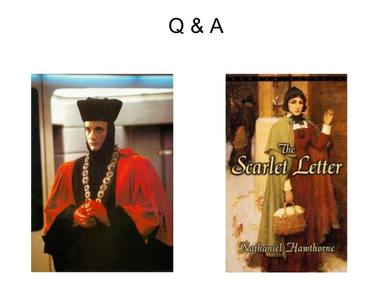
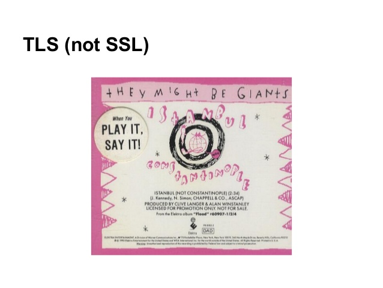
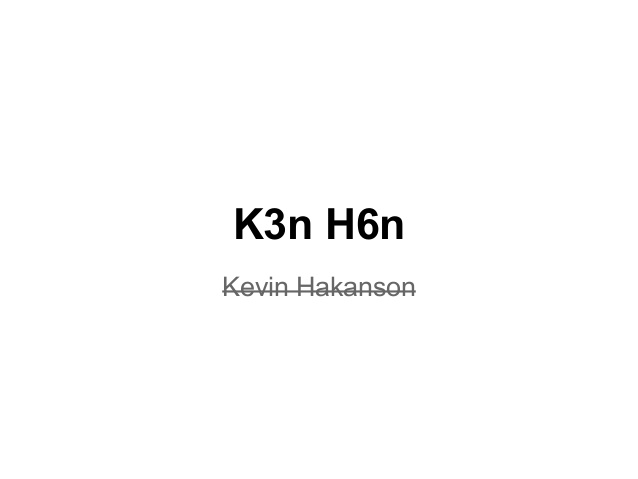
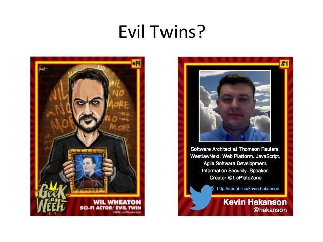
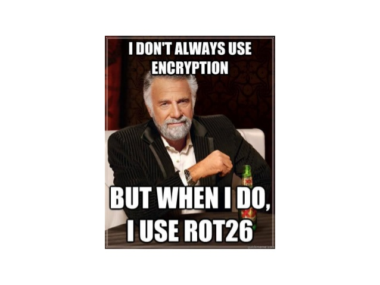
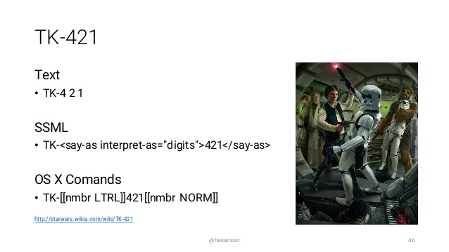

With the transition of [SlideShare from LinkedIn to Scribd](https://news.linkedin.com/2020/august/digital-library-leader-scribd-is-acquiring-slideshare), I looked through my old tech conference presentation slide decks and wanted to highlight some of my slides that (maybe) were not as humorous as I planned. They say "If you have to explain a joke, it's not funny" but I don't care what "they" say - these are getting an explanation.

From [Implementing Messaging Patterns in JavaScript using the OpenAjax Hub](https://www.slideshare.net/kevinhakanson/implementing-messaging-patterns-in-java-script-using-the-openajax-hub/51), this "Q & A" slide refers to [Q](https://en.wikipedia.org/wiki/Q_(Star_Trek)) from Star Trek: The Next Generation (1987) and [A](https://en.wikipedia.org/wiki/The_Scarlet_Letter) as the Scarlet Letter from the classic Nathaniel Hawthorn novel (1850).

From [Developer's Guide to JavaScript and Web Cryptography](https://www.slideshare.net/kevinhakanson/developers-guide-to-javascript-and-web-cryptography/21), this pre-apology slide for when I accidentally said SSL (Secure Sockets Layer) instead of TLS (Transport Layer Security), was a reference to the They Might be Giants 1990 version of [Istanbul (Not Constantinople)](https://en.wikipedia.org/wiki/Istanbul_(Not_Constantinople)).

From [Internationalize your JavaScript Application: Prepare for "the next billion" internet users](https://www.slideshare.net/kevinhakanson/internationalize-your-javascript-application-prepare-for-the-next-billion-internet-users/13), following where I explained that internationalization was abbreviated as **i18n** and localization was abbreviated as **l10n**, I attempted to make a [numeronym](https://en.wikipedia.org/wiki/Numeronym) joke out of my own name (which also ends in **n**) with Kevin Hakanson being replaced by **K3n H6n**.

From [Make your own Print & Play card game using SVG and JavaScript](https://www.slideshare.net/kevinhakanson/make-your-own-print-play-card-game-using-svg-and-java-script/103), after I built up this personalized trading card using SVG (Scalable Vector Graphics), I egotistically put it side by side with the original template. This was not just another Star Trek: The Next Generation reference but also honored the [second International TableTop Day](https://en.wikipedia.org/wiki/TableTop#International_TableTop_Day) that was being live streamed by Wil Wheaton that very same day in 2014.

From [Securing TodoMVC Using the Web Cryptography API](https://www.slideshare.net/kevinhakanson/securing-todomvc-using-the-web-cryptography-api/56), back when internet meme options were not as rich as they are today, I used [The Most Interesting Man in the World](https://en.wikipedia.org/wiki/The_Most_Interesting_Man_in_the_World) to make a substitution cipher joke about ROT26 (which is equivalent to no encryption at all). Another throwback to my college years when [NTTP](https://en.wikipedia.org/wiki/Network_News_Transfer_Protocol) group posts used [ROT13](https://en.wikipedia.org/wiki/ROT13) to obscure answers to jokes and puzzles.

From [ng-owasp: OWASP Top 10 for AngularJS Applications](https://www.slideshare.net/kevinhakanson/ng-owasp-ndc/8), as I was explaining the presentation would focus on front-end technologies like HTML and JavaScript. I made the slide title of `html[ng-app]:focus, script:focus` a syntactically correct CSS selector. This referenced that AngularJS added `class="ng-app"` to the `<html>` element, JavaScript uses the `<script>` element, and I misappropriated the [:focus](https://developer.mozilla.org/en-US/docs/Web/CSS/:focus) CSS pseudo-class.

![html[ng-app]:focus, script:focus](images/ngowasp-owasp-top-10-for-angularjs-applications-8-638.jpg)

From [Introduction to Speech Interfaces for Web Applications](https://www.slideshare.net/kevinhakanson/introduction-to-speech-interfaces-for-web-applications/46), where I made a Star Wars reference to line "[TK-421](https://starwars.fandom.com/wiki/TK-421) why aren't you at your post?" Each digit of 421 is enumerated by the actor, but most speech-to-text engines will say "four-hundred twenty-one" requiring custom mark-up to hear the intended result.

Hopefully, you found at least one of these funny without the explanation. Visit [kevinhakanson.com/presentations](https://kevinhakanson.com/presentations) for links to all my slide decks, associated code samples, and some video recordings.

---

*Original version appears as a [LinkedIn article](https://www.linkedin.com/pulse/7-attempts-slide-deck-humor-kevin-hakanson/)*