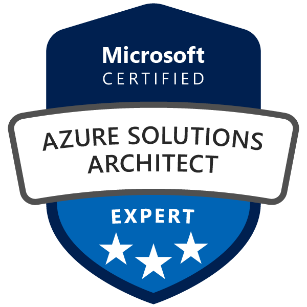

I can now add [Microsoft Certified: Azure Solutions Architect Expert](https://www.youracclaim.com/earner/earned/badge/fc68e9e7-e271-429a-b3c9-e68205b1f250) to my resume.  This certification requires passing two exams, [AZ-303](https://docs.microsoft.com/en-us/learn/certifications/exams/az-303) and [AZ-304](https://docs.microsoft.com/en-us/learn/certifications/exams/az-304), both of which I completed this month.

However, my certification journey was not as quick as it may appear.  I started studying for [AZ-300](https://docs.microsoft.com/en-us/learn/certifications/exams/az-300), off and on, earlier this year and was almost ready to take that exam in July.  However, when I saw that AZ-300/AZ-301 was schedule to be retired in September, I decided to wait until their replacements (AZ-303/AZ-304) came out of beta.

Luckily, I had a recommendation not to wait too long between the exams because of the content overlap.  That plus the voucher for a free Microsoft Certification exam I received via in the [Microsoft Ignite Cloud Skills Challenge](https://csc.docs.microsoft.com/ignite/registration) gave me the confidence I needed. I even scored higher on the second exam.
