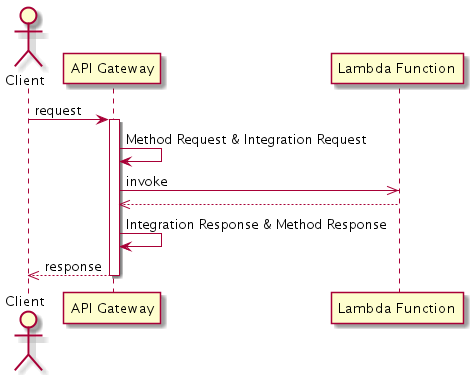
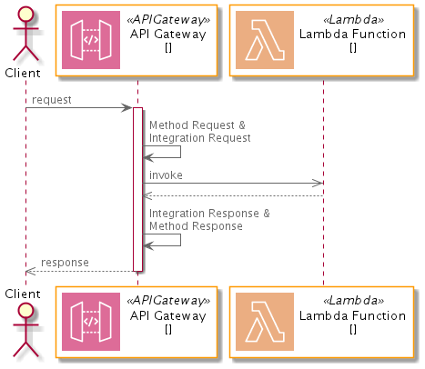
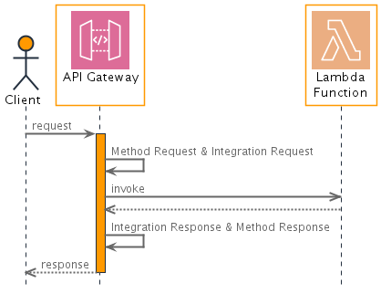

I've blogged about [UML Sequence Diagrams using PlantUML](/2019-06-09-uml-sequence-diagrams-using-plantuml) before, but now my Sequence Diagrams are more beautiful after using the [AWS Icons for PlantUML](https://github.com/awslabs/aws-icons-for-plantuml) and reading the [PlantUML Sequence Diagram docs](https://plantuml-documentation.readthedocs.io/en/latest/diagrams/sequence.html).

Let's start with a basic PlantUML sequence diagram.

```
@startuml

actor "Client" as c
participant "API Gateway" as api
participant "Lambda Function" as f

c->api: request
activate api
api->api: Method Request & Integration Request
api->>f: invoke
api<<--f: 
api->api: Integration Response & Method Response
c<<--api: response
deactivate api

@enduml
```



Let's modify that first paragraph to include some definitions for AWS Icons for our participants.

```
!define AWSPuml https://raw.githubusercontent.com/awslabs/aws-icons-for-plantuml/v10.0/dist
!includeurl AWSPuml/AWSCommon.puml
!includeurl AWSPuml/Compute/Lambda.puml
!includeurl AWSPuml/ApplicationIntegration/APIGateway.puml

actor "Client" as c
APIGatewayParticipant(api, "API Gateway", )
LambdaParticipant(f, "Lambda Function",)
```



That looks better, but I really like the icons only on top and more AWS orange in the diagram.  I create a separate `aws.puml` file for my definitions and settings so it could be reused across multiple diagrams.

```
!define AWSPuml https://raw.githubusercontent.com/awslabs/aws-icons-for-plantuml/v10.0/dist
!includeurl AWSPuml/AWSCommon.puml
!includeurl AWSPuml/Compute/Lambda.puml
!includeurl AWSPuml/ApplicationIntegration/APIGateway.puml

'Comment out to use default PlantUML sequence formatting
skinparam participant {
    BackgroundColor AWS_BG_COLOR
    BorderColor AWS_BORDER_COLOR
}

skinparam actor {
    BackgroundColor AWS_BORDER_COLOR 
    BorderColor AWS_COLOR 
}

skinparam sequence { 
    ArrowThickness 2
    LifeLineBorderColor AWS_COLOR
    LifeLineBackgroundColor AWS_BORDER_COLOR
}

skinparam shadowing false
skinparam MaxMessageSize 400

'Hide the bottom boxes
hide footbox

!definelong CustomLambdaParticipant(p_label, p_alias)
participant "<color:#D86613><$Lambda></color>\np_label" as p_alias
!enddefinelong

!definelong CustomAPIGatewayParticipant(p_label, p_alias)
participant "<color:#CC2264><$APIGateway></color>\np_label" as p_alias
!enddefinelong
```

Let's modify that first paragraph again to include our `aws.puml` and use our newly defined custom AWS participants.

```
!include aws.puml

actor "Client" as c
CustomAPIGatewayParticipant("API Gateway\n", api)
CustomLambdaParticipant("Lambda\nFunction", f)
```



I think this looks a lot nicer, not only because of the icons and color, but by hiding the footer, thickening the arrows, and removing shadowing.