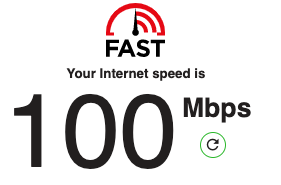
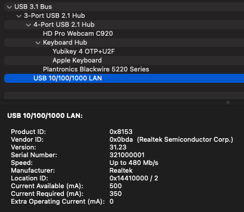

My current workstation setup includes a [ThinkVision P27h-20 Flat Panel Monitor](https://support.lenovo.com/us/en/solutions/pd500392-thinkvision-p27h-20-flat-panel-monitor-overview) which offers a "full-functioned USB Type-C one cable solution with the capability to deliver up to 90W power delivery and an Ethernet signal." There are a lot of devices on my Wi-Fi, so I often choose to "hard-wire" with a Cat6 cable.

During some recent network issues, I decide to visit [fast.com](https://fast.com/) to check my internet speed. My current plan is rated at 300 Mbps downstream and I often get faster speeds reported. I was surprised to see the result below of exactly 100 Mbps.

The LED light on the corresponding router port indicated a [Gigabit Ethernet](https://en.wikipedia.org/wiki/Gigabit_Ethernet) (GbE) connection - not the slower [Fast Ethernet](https://en.wikipedia.org/wiki/Fast_Ethernet) (FE) which would match that 100 Mbit/s rate.  My best guess (after some internet searches) is that integrated USB 2.1 Hub with its "Up to 480 Mb/s" speed is the limiting factor.

How did this hardware get designed with a USB C 3.1 interface on one side, a USB 10/100/1000 LAN on the other, but put a limiting USB 2.1 Hub in the middle?  Needless to say, I switched to a wireless connection.
