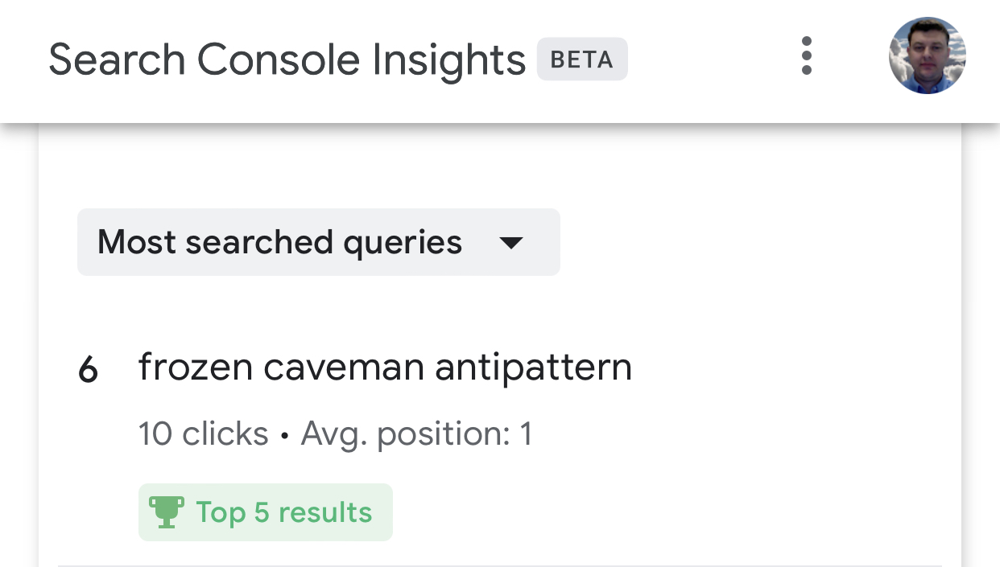

After I received my "Your December Search performance for kevinhakanson.com" email, I took a look at Search Console Insights.  I have a #1 position search result on Google for my [The Frozen Caveman Antipattern](/2017-08-08-the-frozen-caveman-antipattern) blog.

Since this was fun for me to see, I shared with my family and almost immediately got this message from my daughter.

> "Anything can be #1 if the search criteria is specific enough"

Funny and true.  I was glad to see her use [digital literacy](https://en.wikipedia.org/wiki/Digital_literacy) skills to "assess and critically evaluate information."