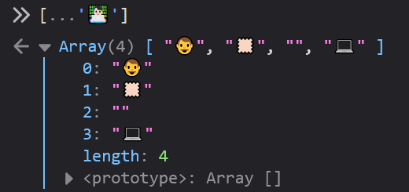

Today I learned about [Emoji ZWJ Sequences](https://unicode.org/emoji/charts/emoji-zwj-sequences.html) and what it takes to create the "man technologist: light skin tone" emoji I often set in my slack status.  This is actually multiple unicode characters "smashed" together using a Zero Width Joiner (ZWJ) sequence.  

Since I am authoring this post on Windows, I used that emoji keyboard by typing Windows logo key + . (period) and selecting the emoji.  I then used the JavaScript [Spread syntax (...)](https://developer.mozilla.org/en-US/docs/Web/JavaScript/Reference/Operators/Spread_syntax) to expand the characters involved.   Hopefully the JavaScript snippet below renders the character.

```javascript
[...'👨🏻‍💻']
```

To make sure all these characters are visible, I took a screenshot on the Firefox developer tools console.



I didn't research all the technical details on how these ZWJ sequences work, but I'm sure someone has blogged about it.
