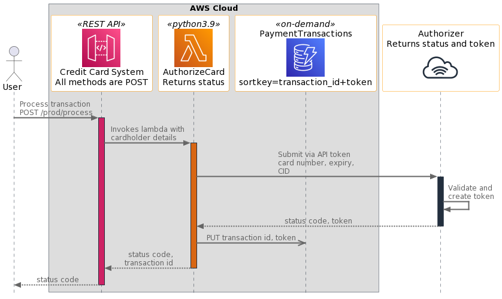

Last year with [Adding AWS Icons to PlantUML Sequence Diagrams](/2021-08-12-adding-aws-icons-to-plantuml-sequence-diagrams) I started making my diagrams look a bit better.  However, the native sprite format looked somewhat washed out to me.

My investigations resulted in some Python coding and deeper understanding of the [PlantUML syntax](https://plantuml.com/sequence-diagram) which defaulted to PNG icons with full color fidelity.  This was included in [Release 13.0](https://github.com/awslabs/aws-icons-for-plantuml/releases/tag/v13.0) and I'm a maintainer on another open-source project.

Here is an example of what they look like now:

