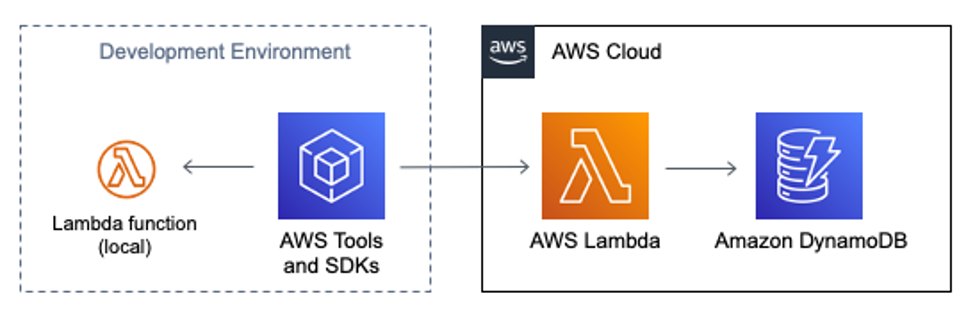

I've been looking at serverless, [event-driven architectures](https://docs.aws.amazon.com/lambda/latest/operatorguide/event-driven-architectures.html) using AWS Lambda and how to test individual components.  In this post, I take an example AWS Lambda function using the Python [runtime](https://docs.aws.amazon.com/lambda/latest/dg/lambda-runtimes.html) which was not designed for testability.  I then incrementally introduce changes that result in an updated version.  

## Example Scenario

A developer is using their local development environment to code and test an AWS Lambda function. The Python-based Lambda function implements a simple hit counter, using Amazon DynamoDB to persist the counts.



The Python code below represents the first iteration which was not designed for testability.  The `lambda_handler` receives an `event` object with a string `key` and optional integer between 1 and 9 (inclusive). If the validation logics passes, it creates or updates a DynamoDB table item, adding the `increment` value to the `hits` field, and returns a response with the updated `count` value.

```python
# "before" version of hitcounter - not designed for testability
import os
import boto3

# run once when the execution environment is created
DYNAMODB_TABLE_NAME = os.environ["DYNAMODB_TABLE_NAME"]
dynamodb_resource = boto3.resource('dynamodb')
dynamodb_table = dynamodb_resource.Table(DYNAMODB_TABLE_NAME)

def lambda_handler(event, context):
    increment = event.get('increment', 1)
    if (increment < 1 or increment > 9):
        return {"count": -1}

    response = dynamodb_table.update_item(
        Key={"PK": event.get('key')},
        UpdateExpression="ADD hits :num",
        ExpressionAttributeValues={
            ":num": increment
        },
        ReturnValues="UPDATED_NEW"
    )

    return {"count": response['Attributes']['hits']}
```

This code follows the [best practices for working with AWS Lambda functions](https://docs.aws.amazon.com/lambda/latest/dg/best-practices.html) recommendations of using [environment variables](https://docs.aws.amazon.com/lambda/latest/dg/configuration-envvars.html) to pass operational parameters (`DYNAMODB_TABLE_NAME`) and initializing the DynamoDB connection outside of the function handler for reuse by subsequent invocations processed by the same instance.  However, it did not separate the Lambda handler and core logic to make a more unit-testable function.  The developer wants to test the full functionality of this Lambda function prior to deployment in AWS, including its interactions with the DynamoDB table.

## Defining an Event Schema

An [event](https://docs.aws.amazon.com/lambda/latest/dg/gettingstarted-concepts.html#gettingstarted-concepts-event) is a JSON-formatted document that contains data for a Lambda function to process. The Python runtime converts this event into a [dictionary object](https://docs.python.org/3/c-api/dict.html) and passes it to the handler.  When a Lambda function is invoked synchronously, the function's response is sent back to the invoker.  From inspecting the Python code above, you can infer the event and response structure have the following shape.

```json
// sample event
{
  "key": "SampleEvent",
  "increment": 2
}

// sample response
{
  "count": 2
}
```

Type annotations are a more formal way to define the event and response structures.  The Python [typing](https://docs.python.org/3/library/typing.html) module provides runtime support for type hints with [TypeDict](https://docs.python.org/3/library/typing.html#typing.TypedDict) being a special construct which declares a dictionary type.  The [AWS Lambda Powertools for Python](https://awslabs.github.io/aws-lambda-powertools-python/latest/) provides a static typing class for [`LambdaContext`](https://awslabs.github.io/aws-lambda-powertools-python/latest/utilities/typing/#lambdacontext) and a [Parser](https://awslabs.github.io/aws-lambda-powertools-python/latest/utilities/parser/) utility for data validation.

The code below creates [Python classes](https://docs.python.org/3/tutorial/classes.html) for `HitCounterEvent` and `HitCounterResponse`, then annotates the `lambda_handler` function with them.  This is not enforced by the Python runtime, but enables type checking and autocompletion inside IDEs. The `HitCounterEvent` class inherits from `BaseModel` which supports decorating of methods to provide validation.  The logic that defaults the `increment` value to 1 and performs a range check between 1 and 9 (inclusive) has moved out of `lambda_handler` and into `HitCounterEvent`.

```python
from typing import TypedDict
from aws_lambda_powertools.utilities.parser import BaseModel, parse, validator
from aws_lambda_powertools.utilities.typing import LambdaContext

# new class definitions for Event and Response
class HitCounterEvent(BaseModel):
    key: str
    increment: int = 1

    @validator("increment")
    def set_increment(cls, v):
        if (v < 1 or v > 9):
            raise ValueError("increment must be between 1-9 (inclusive)")
        return v

class HitCounterResponse(TypedDict):
    count: int

def lambda_handler(event: HitCounterEvent, context: LambdaContext) -> HitCounterResponse:
    # function body from above returning result
```

## First Unit Tests

By using well-defined event and response objects, writing unit tests is simplified by not searching for dictionary key string values.  The `@validator` decorated method is executed when constructing `HitCounterEvent` objects.   The tests below use the [unittest](https://docs.python.org/3/library/unittest.html) unit testing framework which look similar to other testing frameworks from other languages.

```python
from unittest import TestCase
from src.hitcounter2.app import (HitCounterEvent, HitCounterResponse, lambda_handler)

class TestHitCounterEventValidation(TestCase):
    def test_get_increment_default(self):
        event = HitCounterEvent(key="test")
        self.assertEqual(event.increment, 1)

    def test_get_increment_2(self):
        event = HitCounterEvent(key="test", increment=2)
        self.assertEqual(event.increment, 2)

    def test_get_increment_0(self):
        with self.assertRaises(ValueError):
            event = HitCounterEvent(key="test", increment=0)
```

## Next Unit Test

The Lambda runtime doesn’t know about or construct `HitCounterEvent`, but as mentioned earlier, deserializes JSON into a dictionary object.  The `lambda_handler` needs to explicitly call parse with the `event` object and specify the `HitCounterEvent` model.  The Lambda handler is still responsible for handling `ValueError` and returning a `HitCounterResponse`.

```python
def lambda_handler(event: HitCounterEvent, context: LambdaContext) -> HitCounterResponse:
    try:
        event = parse(event=event, model=HitCounterEvent)
    except ValueError:
        return HitCounterResponse(count=-1)
        
    # remaining function body from above returning result
```

The test below creates a `dict` with the `increment` value of 0 and calls the `lambda_handler` . Since this is outside of the allowed range, the test expects validation failure and asserts the `HitCounterResponse` has a `count` of -1.

```python
    def test_lambda_handler_increment_0(self):
        test_event_dict = {"key": "HandlerTest", "increment": 0}
        test_response: HitCounterResponse = lambda_handler(
            event=test_event_dict, context=None)
        self.assertEqual(test_response["count"], -1)
```

## Preparing for Mocking

The original code unconditionally creates DynamoDB resources, causing challenges for mocking and patching inside unit tests.  To continue the best practice to create once and reuse, I declare a global variable named `_SERVICES` and initially set to [*None*](https://docs.python.org/3/c-api/none.html).  I also create a `Services` class to hold the set of AWS resource, using resource names as incoming parameters to remove the dependency on specific environment variable names.  Finding one of the [defined runtime environment variables](https://docs.aws.amazon.com/lambda/latest/dg/configuration-envvars.html#configuration-envvars-runtime) indicates this code is running inside a Lambda runtime, and a `Services` object should be constructed.

```python
# define a Services class for AWS service resources
class Services:
    def __init__(self, dynamodb_table_name: str):
        self.dynamodb_resource = boto3.resource('dynamodb')
        self.dynamodb_table = self.dynamodb_resource.Table(
            dynamodb_table_name)

_SERVICES: Services = None
if os.getenv("AWS_LAMBDA_FUNCTION_NAME"):
    # only initialize _SERVICES under Lambda runtime
    _SERVICES = Services(dynamodb_table_name=os.getenv("DYNAMODB_TABLE_NAME"))
```

The code which updates DynamoDB items is extracted into an `update_hits` function, taking a `Services` object parameter rather than directly accessing the global variable.  This refactoring enables both mocking for unit tests and independence for future integration tests.

```python
def update_hits(services: Services, key: str, increment: int) -> int:
    response = services.dynamodb_table.update_item(
        Key={"PK": key},
        UpdateExpression="ADD hits :num",
        ExpressionAttributeValues={
            ":num": increment
        },
        ReturnValues="UPDATED_NEW")

    return response["Attributes"]["hits"]
```

The updated `lambda_handler` now calls `parse` and explicitly passes `_SERVICES` lazy into `update_hits`.

```python
def lambda_handler(event: HitCounterEvent, context: LambdaContext) -> HitCounterResponse:

    try:
        event = parse(event=event, model=HitCounterEvent)
    except ValueError:
        return HitCounterResponse(count=-1)

    # explicitly pass _SERVICES into function
    hits = update_hits(
        services=_SERVICES, key=event.key, increment=event.increment)

    return HitCounterResponse(count=hits)
```

## Unit Testing with Mock Amazon DynamoDB

During normal execution, the Lambda function code accesses AWS resources such as a DynamoDB table.  When running tests, I want to test interactions with these services without accidentally changing live data in DynamoDB. I may also want to run tests in an environment without a connection to AWS.

This solution uses the [Moto](http://docs.getmoto.org/en/latest/index.html#) third-party library to mock out AWS services, replacing them with simulated versions running locally.  Instead of using the live AWS service, DynamoDB is mocked and simulated for the entire test class using the [moto.mock_dynamodb](http://docs.getmoto.org/en/latest/docs/services/dynamodb.html?highlight=mock_dynamodb) decorator.  This both replaces the [boto3 dynamodb resource](https://boto3.amazonaws.com/v1/documentation/api/latest/reference/services/dynamodb.html) with a mock object storing data in memory and enables assertions about how that object has been used.  In the `TestCase` below, the `setUp` and `tearDown` methods construct and remove a mocked DynamoDB table and manipulate [sys.modules](https://docs.python.org/3/library/sys.html#sys.modules) to set the `_SERVICES` global to an instances of the `Services` class.  Also note there is no dependency on setting specific environment variables.

```python
import moto

@moto.mock_dynamodb
class TestHitCounterLambdaDynamoDB(TestCase):
    # Test Set up
    def setUp(self) -> None:
        # Set up the services: construct a (mocked!) DynamoDB table
        self.DYNAMODB_TABLE_NAME = "unit_test_ddb"
        dynamodb = boto3.resource("dynamodb", region_name="us-east-1")
        dynamodb.create_table(
            TableName=self.DYNAMODB_TABLE_NAME,
            KeySchema=[{"AttributeName": "PK", "KeyType": "HASH"}],
            AttributeDefinitions=[
                {"AttributeName": "PK", "AttributeType": "S"}],
            BillingMode="PAY_PER_REQUEST")

        # set the _SERVICES global
        sys.modules["src.hitcounter2.app"]._SERVICES = Services(
            dynamodb_table_name=self.DYNAMODB_TABLE_NAME)
            
    # tests go here

    def tearDown(self):
        # [12] Remove (mocked!) DynamoDB Table
        dynamodb = boto3.client("dynamodb", region_name="us-east-1")
        dynamodb.delete_table(TableName=self.DYNAMODB_TABLE_NAME)

        sys.modules["src.hitcounter2.app"]._SERVICES = None
```

The following code tests the entire Lambda function at once, including the `lambda_handler` and all the extracted functions.  It passes because `moto.mock_dynamodb` implements both the DynamoDB resource creation and the update item logic.  This is more course-grained than an ideal unit test and also relies on the moto emulation of DynamoDB.

For the test event data, a good practice is saving them with as separate JSON files in your project rather than hard coding them inline.  The test code also introduces a `load_test_event` helper method which allows `test_event` to be loaded from the test data location.  The `tests/events/SampleEvent.json` file used in the test below  contains the same sample event from earlier in this blog.  Externalizing test data info files also scales out test coverage without repeating similar test methods.

```python
    def load_test_event(self, test_event_file_name: str) -> HitCounterEvent:
        return HitCounterEvent.parse_file(f"tests/events/{test_event_file_name}.json")

    def test_lambda_handler(self):
        # invoke lambda_handler
        test_event: HitCounterEvent = self.load_test_event("SampleEvent")
        test_response: HitCounterResponse = lambda_handler(
            event=test_event, context=None)

        self.assertEqual(test_response["count"], 2)
```

The `update_hits` method can be tested directly. This realizes the value of passing in the `Services` object instead of taking a dependency on a Global. This test doesn’t depend on `lambda_handler` logic, but still uses `mock_dynamodb`. 

```python
    def test_lambda_handler_update_hits(self):
        # call update_hits with explicit Services object
        services = Services(dynamodb_table_name=self.DYNAMODB_TABLE_NAME)
        hits = update_hits(
            services=services, key="update_hits", increment=3)
        self.assertEqual(hits, 3)
```

With `update_hits` separately tested, this enables internal testing of `lambda_handler` logic independent of `update_hits` behaviors. The code below uses [patch](https://docs.python.org/3/library/unittest.mock.html#unittest.mock.patch) decorators and a [MagicMock](https://docs.python.org/3/library/unittest.mock.html#unittest.mock.MagicMock) object from `unittest.mock`.  This sets a `return_value` for the function call and use `assert_called_once_with` to inspect the incoming parameter values.  The test still calls `lambda_handler`, but two implicit dependencies are removed: 1) Mocking `_SERVICES` with a [*sentinel*](https://docs.python.org/3/library/unittest.mock.html#sentinel) removes all dependencies on `dynamodb` resources ; and 2) Mocking `update_hits` still provides a return value even when the `moto.mock_dynamodb` implementation logic emulating [DynamoDB update expressions](https://docs.aws.amazon.com/amazondynamodb/latest/developerguide/Expressions.UpdateExpressions.html) was removed.

```python
    # Patch _SERVICES attribute and update_hits function call
    @patch("src.hitcounter2.app._SERVICES", sentinel.attribute)
    @patch("src.hitcounter2.app.update_hits")
    def test_lambda_handler_mocks(self,
                                  mock_update_hits: MagicMock):
        # Test setup - Return mocked data
        mock_update_hits.return_value = 2

        # invoke lambda_handler
        test_event: HitCounterEvent = self.load_test_event("SampleEvent")
        test_response: HitCounterResponse = lambda_handler(
            event=test_event, context=None)

        # Validate function called with parameter values
        mock_update_hits.assert_called_once_with(services=sentinel.attribute,
                                                 key=test_event.key,
                                                 increment=test_event.increment)

        self.assertEqual(test_response["count"], 2)
```

## Running the Unit Tests

Many IDEs and other tools support running Python tests based on [unitest](https://docs.python.org/3/library/unittest.html), including the [coverage](https://coverage.readthedocs.io/en/6.4.2/index.html) tool for measuring code coverage.  An example of running this command is below and will provide a `OK` or `FAIL` status, indicating if all the tests pass.

```bash
coverage run -m unittest discover
```

The status can be used to determine if the code should then be deployed to AWS.  Tests should be run both in your local development environment and as part of your deployment pipeline.  For example, using [AWS CodePipeline](https://aws.amazon.com/codepipeline/), you could run these tests in an [AWS CodeBuild](https://aws.amazon.com/codebuild/) stage, which would abort any subsequent deployment steps if the tests did not pass.

## Local Integration Testing using Test Events

The [AWS SAM CLI](https://docs.aws.amazon.com/serverless-application-model/latest/developerguide/serverless-sam-cli-install.html) makes it easy to create and manage serverless applications.  You can run an integration test with the Lambda function code running in local docker container using the [sam local invoke](https://docs.aws.amazon.com/serverless-application-model/latest/developerguide/sam-cli-command-reference-sam-local-invoke.html) command and integrate with a deployed DynamoDB table.  In the example below, `env.json` is an [environment variable file](https://docs.aws.amazon.com/serverless-application-model/latest/developerguide/serverless-sam-cli-using-invoke.html#serverless-sam-cli-using-invoke-environment-file) containing the value for `DYNAMODB_TABLE_NAME` and `tests/events/SampleEvent.json` is the same JSON file as the unit test.

```bash
sam local invoke \
  --env-vars env.json \
  --event tests/events/SampleEvent.json \
  HitCounter2Function 
```

The [AWS Command Line Interface](https://aws.amazon.com/cli/) (AWS CLI) has a command to invoke a Lambda function. In the example below, the deployed Lambda function name is specified, the payload uses the same `tests/events/SampleEvent.json` from earlier, and the response is saved to a `SampleResponse.json` file.

```bash
aws lambda invoke \
  --cli-binary-format raw-in-base64-out \
  --function-name stackname-HitCounter2Function-XXXXXXXX \
  --payload file://tests/events/SampleEvent.json \
  SampleResponse.json
```

[Testing Lambda functions from the AWS console](https://docs.aws.amazon.com/lambda/latest/dg/testing-functions.html) is possible using either private test events or sharable test events. Lambda saves shareable test events as schemas in an [Amazon EventBridge (CloudWatch Events) schema registry](https://docs.aws.amazon.com/eventbridge/latest/userguide/eb-schema-registry.html) named `lambda-testevent-schemas`.  Sharable test events can be created either in the console or via a [AWS::EventSchemas::Schema](https://docs.aws.amazon.com/AWSCloudFormation/latest/UserGuide/aws-resource-eventschemas-schema.html) CloudFormation resource.
