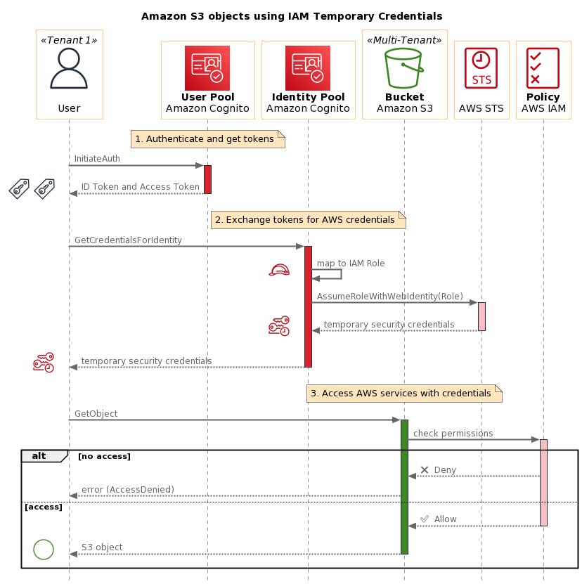
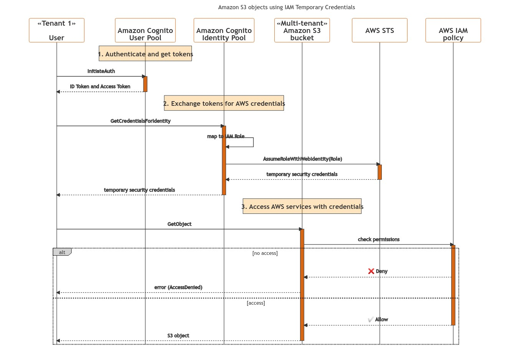
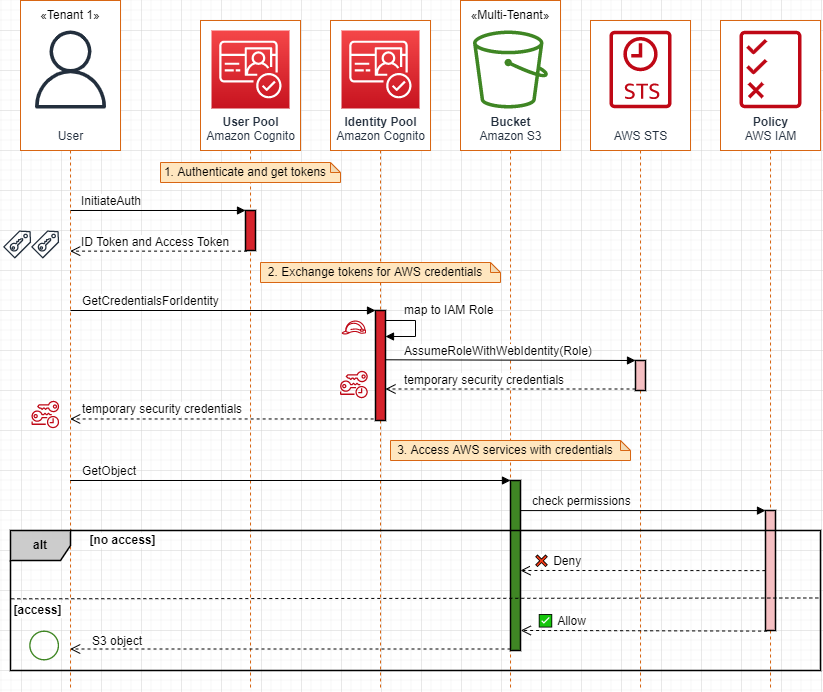

I'm still having fun creating UML Sequence Diagrams using PlantUML.  On August 19, 2022 I published [Sequence Diagrams enrich your understanding of distributed architectures](https://aws.amazon.com/blogs/architecture/sequence-diagrams-enrich-your-understanding-of-distributed-architectures/) on the AWS Architecture Blog.  The `.puml` source files from that blog post are available in the [architecture-blog](https://github.com/awslabs/aws-icons-for-plantuml/tree/main/examples/architecture-blog) examples folder inside the [AWS Icons for PlantUML](https://github.com/awslabs/aws-icons-for-plantuml) GitHub project.  This blog was included as one of the five stories in [#103 Dear Architects](https://mailchi.mp/deararchitects/103-dear-architects) and both the blog and the AWS Icons for PlantUML project were mentioned in [AWS open source news and updates, #127](https://dev.to/094459/aws-open-source-news-and-updates-127-56n9).

## Mermaid

Another tool that gets mentioned for Diagrams-as-Code is [Mermaid](https://mermaid-js.github.io/mermaid/#/) which "uses Markdown-inspired text definitions and a renderer to create and modify complex diagrams."  For a target diagram to create with Mermaid, I used the end-state, PlantUML-based diagram from my [Creating a Sequence Diagram for an Amazon Cognito scenario](https://github.com/awslabs/aws-icons-for-plantuml/tree/main/examples/cognito-scenario) tutorial, which adds AWS service icons and colors for greater visual impact.  Below is a PNG export of that diagram (SVG always seems to look better).



I wanted to see how close I could reproduce that look.  Using Mermaid [directives](https://mermaid-js.github.io/mermaid/#/directives) I was able to get some control over colors and styling by including the `%%{init: {...}}%%` blocks in the source below.  The [theming for sequence digrams](https://mermaid-js.github.io/mermaid/#/theming?id=sequence-diagram) is documented, but I found [styles.js](https://github.com/mermaid-js/mermaid/blob/develop/packages/mermaid/src/diagrams/sequence/styles.js) to be the authoritive source.  The configurations specific for sequence diagrams were also best found in the [defaultConfig.ts](https://github.com/mermaid-js/mermaid/blob/develop/packages/mermaid/src/defaultConfig.ts) source code.  I did not find a way to use images for the AWS icons inside my Mermaid sequence diagram.

```
%%{init: {'sequence': { 'mirrorActors': false, 'rightAngles': true, 'messageAlign': 'center', 'actorFontSize': 20, 'actorFontWeight': 900, 'noteFontSize': 18, 'noteFontWeight': 600, 'messageFontSize': 14}}}%%
%%{init: {'theme': 'base', 'themeVariables': {'labelBoxBkgColor': 'lightgrey', 'labelBoxBorderColor': '#000000', 'actorBorder': '#D86613', 'actorBkg': '#ffffff', 'activationBorderColor': '#232F3E', 'activationBkgColor': '#D86613', 'noteBkgColor': 'rgba(255, 153, 0, .25)', 'noteBorderColor': '#232F3E'}}}%%
sequenceDiagram
    title Amazon S3 objects using IAM Temporary Credentials

    participant user as «Tenant 1»<br /><br />User
    participant userpool as <br />Amazon Cognito<br />User Pool
    participant idpool as <br />Amazon Cognito<br />Identity Pool
    participant s3 as «Multi-tenant»<br />Amazon S3<br />bucket
    participant sts as <br />AWS STS<br />
    participant permissions as <br />AWS IAM<br />policy

    note over userpool: 1. Authenticate and get tokens
    user ->>+ userpool: InitiateAuth
    userpool -->>- user: ID Token and Access Token

    note over idpool: 2. Exchange tokens for AWS credentials
    user ->>+ idpool: GetCredentialsForIdentity
    idpool ->> idpool: map to IAM Role
    idpool ->>+ sts: AssumeRoleWithWebIdentity(Role)
    sts -->>- idpool: temporary security credentials
    idpool -->>- user: temporary security credentials
   
    note over s3: 3. Access AWS services with credentials
    user ->>+ s3: GetObject
    s3 ->>+ permissions: check permissions
    alt no access
      permissions -->> s3: ❌ Deny
      s3 -->> user: error (AccessDenied)
    else access
      permissions -->>- s3: ✅ Allow
      s3 -->>- user: S3 object
    end 
```

Below is the PNG rendered by that source.  Clicking the image will bring you to the [Mermaid Live Editor](https://mermaid.live), which displays the image as the better looking SVG version. Some differences you will see are the text in `note` not spilling out the left and right sides or the emoji font characters rendering differently.

[](https://mermaid-js.github.io/mermaid-live-editor/edit#pako:eNqNVc1O20AQfpWRKxQQhEJcEI0qJPNXcUCtGlouuWzWg7ONvZvuroEQ5dhbH6F9gj5CbzxKn6Szu7YxgZb6EGVnvm9-vpm15xFXKUb9aGVlLqSwfZh3DH4pUXLs0AE6hdBa6YRbpQ1ZLllucAM6WmRjm8gsR2e1unTGAo1hGSa5yCRZOxylRd0hD3P8EyXtQNy6wL2ttvECXTQyv95ydqkstrDbey1bA9310CpjG_1qsVisrAxlqyM7xsL5OiNm0JXjDZ-YFmwUGph3cjbC_EDdHEyyQ5Ur7eC5y5VpnDlOA1A6Rd1gXmz5p2kyuL3naG93dzu-90wyb770T2UWV8wKJZeD9uLeSXy8hGlV1ortlGm7dDZiq72dnQ3Y3ok3gFTa7O2sNcinE1Wa1aM_EizTrBhKoMcKmyMkBbtVEgYxqNFn5NZAaYTM4DQ5g3MspkozPYNDjSkNXdCWDGWgT5m2gospk5YoqIEZuPt5jtIZtu9-vRlpeLkffj-S_2nWVKncMQOuKuZQZTRhdc-F9wR7HECkz9NPfd129pcQJg51n5W5FV3rq69rb6QJx1HJJ2ifCEGa3ZdwMYDB-SAcHmOnqAthDE19iUNyh8NU5YLPapHdaEFdkQK1WHQTNiEpadOpLc7IzWQKGVqwaoLSBJ4fSHd_f73FOyVRBBEc-R7lFewStOuPBDuCcxfJx004p5sYDI9rCvrTrd-E4xs-ZjLDqgq4VBpcX7y9OA8rq9lv0bbW60TpemSBUA2ZKA2jYFPK41f0g8pxGbfuRtKHxJiyQAe4EHZ8gaM67qqzrQWWG17ovg5um6U3yEvtVudRE3Wulmz_QVuWz8R9iDdrjZ1aFOlK0AmuqeJ_aeeopNs7f2WrTuLgaq1YH_gY-aRtCliWW6oDmM8cTPBgN11nPsnvH9_gCOWsBrkszheaRvcNgdXQAcEEppWuSJ-TZ-J3Q4LvXyHJc3W9lKHWtXkxVXFpKelftBEVFI6JlL5xc-caRv7lP4z69DfFS0YXehgN5YKgrLRqMJM86vsPWlROU7oH1csw6vtv3-IP3EVgcg)

## Diagrams.net (Draw.IO)

You can use Diagrams.net (Draw.IO) as a drawing tool and create "pixel perfect" versions of your sequence diagrams (which I spent too much time doing and it doesn't look perfect).  You can also insert your PlantUML or Mermaid by clicking `Arrange` then `Insert > Advanced` and choose which diagram type.  I created a `.drawio` file with three tabs:  the hand drawn version; the PlantUML rendered import; and the Mermaid rendered import.

Below is a PNG export of that drawn diagram with the "Grid" option. I also chose the "Include a copy of my diagram" option, so (hopefully) you can click this PNG and edit it in `app.diagrams.net`.

[](https://app.diagrams.net/#Uhttps%3A%2F%2Fraw.githubusercontent.com%2Fhakanson%2Fblog-posts-markdown%2Fmain%2F2022-10-02-sequence-diagrams-with-mermaid-and-diagramsnet%2Fimages%2FSequenceDiagrams-Diagrams.net.drawio.png)
