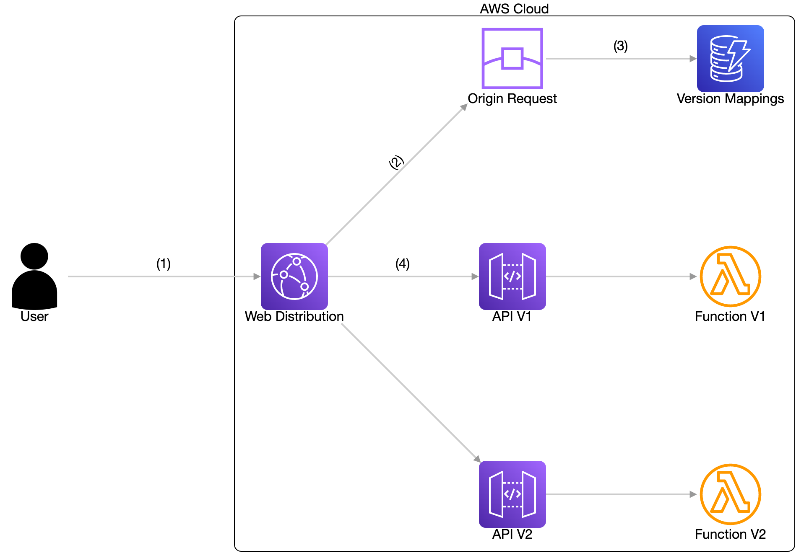
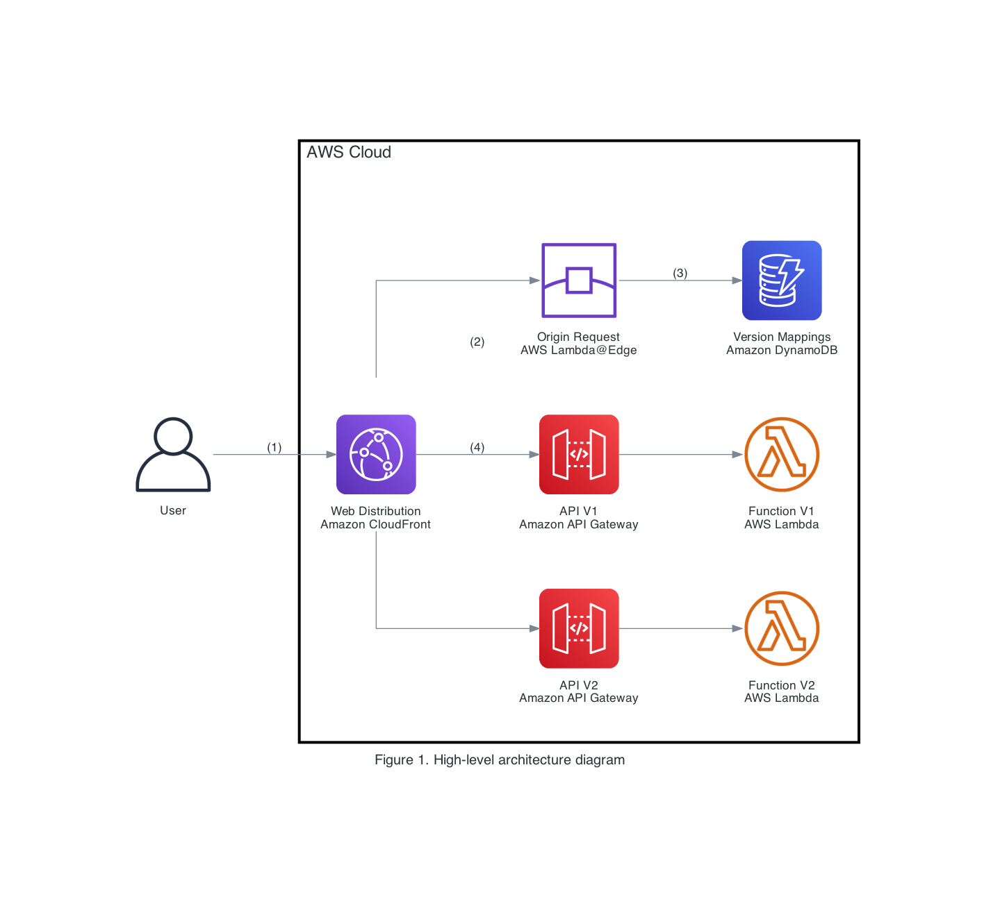

So much fun on the [Build On AWS weekly - Code me some diagrams](https://www.twitch.tv/videos/1679798127) Twitch stream today talking diagrams-as-code with Darko, and surprising him with this:


The PlantUML source code (except for the full base64 PNG).

```
@startuml Darko

!include <awslib/AWSCommon.puml>
!include <awslib/Compute/EC2.puml>
!include <awslib/DeveloperTools/CommandLineInterface.puml>
!include <awslib/General/all.puml>
!include <awslib/Groups/all.puml>
!include <awslib/ManagementGovernance/ManagementConsole.puml>

' truncating PNG for blog code sample
!function $DarkoIMG($scale=1)
!return ""
!endfunction

' Groups are rectangles with a custom style using stereotype - need to hide
hide stereotype
skinparam linetype ortho
skinparam rectangle {
    BackgroundColor AWS_BG_COLOR
    BorderColor transparent
}

rectangle "$DarkoIMG()\nDarko" as darko
rectangle "$ClientIMG()\nCommodore 128" as client
AWSCloudGroup(cloud){
  RegionGroup(region, "eu-central-1") {
    rectangle "$CommandLineInterfaceIMG()\nCLI" as cli
    VPCGroup(vpc) {
      rectangle "$EC2IMG()\nEC2" as ec2
    }
  }
}

darko -> client
client -> cli
cli -> ec2

@enduml
```


I also got to talk about Architecture Decision Records and the context for when I choose diagrams-as-code over presentation software or drawing tools.

* ADR001 - Use PowerPoint for presentations
  * AWS Solutions Architects deliver lots of customer facing presentations, many of which combine slides from existing presentations.  These presentations are expected to meet the high bar for quality.
* ADR002 - Use DrawIO (desktop) for documentation
  * Diagram images are included in project documentation, often created in markdown format.
* ADR003 - Use PlantUML for sequence diagrams
  * Sequence diagrams help improve understanding of design across success and error use cases.

Some things didn't make it on the show, but I played with both [CloudGram](https://cloudgram.dedalusone.com/#) and [mingrammer Diagrams](https://diagrams.mingrammer.com/) to attempt a recreation of PlantUML-based Figure 1 from [Sequence Diagrams enrich your understanding of distributed architectures](https://aws.amazon.com/blogs/architecture/sequence-diagrams-enrich-your-understanding-of-distributed-architectures/)

## CloudGram

* [AWS Icons](https://github.com/dedalusj/cloudgram/tree/main/src/images/aws) have pre-rounded corners and were last updated 2 years ago
* No multi-line label support

```
diagram "Figure 1" [direction=lr] {
  generic.user user [label="User", labelPosition="s"];

  group cloud [label="AWS Cloud",style=solid,stroke=black,opacity=0] {
    aws.cloudfront cf [label="Web Distribution", labelPosition="s"];
    aws.cloudfrontEdgeLocation edge [label="Origin Request", labelPosition="s"];
    aws.dynamodb dynamodb [label="Version Mappings", labelPosition="s"];
    
    aws.apiGateway api1 [label="API V1", labelPosition="s"];
    aws.lambdaFunction lambda1 [label="Function V1", labelPosition="s"];
    aws.apiGateway api2 [label="API V2", labelPosition="s"];
    aws.lambdaFunction lambda2 [label="Function V2", labelPosition="s"];
  }

  user -> cf [label="(1)"];
  cf -> edge [label="(2)"];
  edge -> dynamodb [label="(3)"];
  cf -> api1 [label="(4)"];
  api1  -> lambda1;
  cf -> api2 -> lambda2;
}
```



## mingrammer Diagrams

* [AWS Icons](https://github.com/mingrammer/diagrams/tree/master/resources/aws) have pre-rounded corners and most were last updated 2 years ago.
* Can generate GraphViz `.dot` file and directly takes graph/cluster/node/edge attributes

```python
# using https://github.com/mingrammer/diagrams
from diagrams import Diagram, Cluster, Edge
from diagrams.aws.general import User
from diagrams.aws.network import CloudFront, CloudFrontEdgeLocation
from diagrams.aws.mobile import APIGateway
from diagrams.aws.database import Dynamodb
from diagrams.aws.compute import LambdaFunction

# https://www.graphviz.org/docs/graph/
graph_attr = {
  "nodesep": ".3",
  "ranksep": "1.6"
}
# https://www.graphviz.org/docs/clusters/
cluster_attr = {
  "margin": "40",
  "fontsize": "18",
  "bgcolor": "white",
  "style": "diagonals",
  "penwidth": "3",
  "pencolor": "FFFFFF"
}
# https://www.graphviz.org/docs/nodes/
node_attr = {
  "width": "1.2",
  "height": "1.2",
}
# https://www.graphviz.org/docs/edges/
edge_attr = {

}

with Diagram("Figure 1. High-level architecture diagram", graph_attr=graph_attr, node_attr=node_attr, edge_attr=edge_attr, show=False, filename="Figure1", outformat=["png", "dot"]):
  user = User("User")

  with Cluster("AWS Cloud", graph_attr=cluster_attr):
    cf = CloudFront("Web Distribution\nAmazon CloudFront")
    user >> Edge(label="(1)") >> cf
    
    # The order of rendered diagrams is the reverse of the declaration order.
    cf >> APIGateway("API V2\nAmazon API Gateway") >> LambdaFunction("Function V2\nAWS Lambda")
    cf >> Edge(label="(4)") >> APIGateway("API V1\nAmazon API Gateway") >> LambdaFunction("Function V1\nAWS Lambda")
    cf >> Edge(label="(2)") >> CloudFrontEdgeLocation("Origin Request\nAWS Lambda@Edge") >> Edge(label="(3)") >> Dynamodb("Version Mappings\nAmazon DynamoDB")
```


