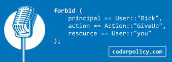

[Cedar](https://github.com/cedar-policy) is an open source policy language and evaluation engine. Cedar enables developers to express fine-grained permissions as easy-to-understand policies enforced in their applications, and decouple access control from application logic. 

However, I had some fun with my own version of [Name That Tune](https://en.wikipedia.org/wiki/Name_That_Tune) representing various song lyrics using the Cedar policy language.  See [this tweet](https://twitter.com/Sarah_Cecc/status/1658498008382861312) for an example of next level [Rickrolling ](https://en.wikipedia.org/wiki/Rickrolling).



```cedar
forbid (
    principal == User::"Rick",
    action == Action::"GiveUp",
    resource == User::"You"
);
```

I'm an 80s rap fan, and took inspiration from [Beastie Boys - No Sleep Till Brooklyn (Official Music Video)](https://www.youtube.com/watch?v=07Y0cy-nvAg) for my next creation.

```cedar
forbid (
    principal in Group::"BeastieBoys",
    action == Action::"sleep",
    resource == Location::"Brooklyn"
)
unless { principal.location == resource };
```

I'll close this post out with a full stanza from [RUN DMC - King Of Rock (Official Video)](https://www.youtube.com/watch?v=qXzWlPL_TKw).

> I'm the king of rock, there is none higher  
> Sucker MC's should call me sire  
> To burn my kingdom, you must use fire  
> I won't stop rockin' till I retire  

```cedar
forbid (
    principal,
    action == Action::"areHigher",
    resource == User::"KingOfRock"
);

permit (
    principal in Group::"SuckerMCs",
    action == Action::"callSire",
    resource == User::"KingOfRock"
);

forbid (
    principal,
    action == Action::"burnKingdom",
    resource == Kingdom::"KingOfRock"
)
unless { principal.use == "fire" };

forbid (
    principal == User::"KingOfRock",
    action == Action::"stopRockin",
    resource
)
unless { principal.retired == true };
```
