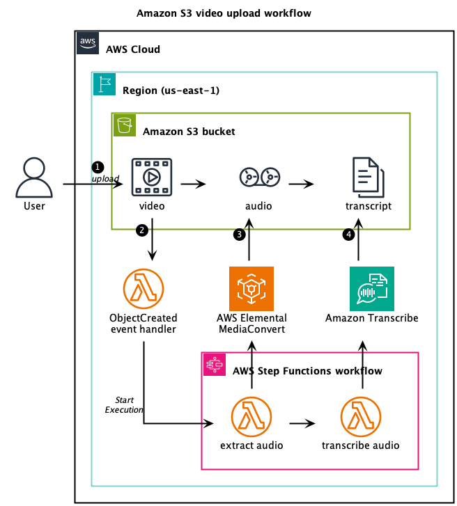
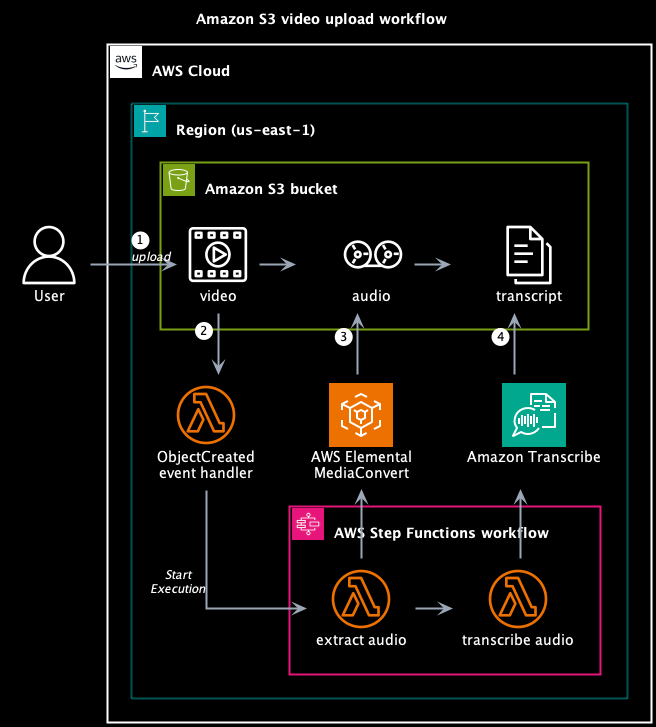
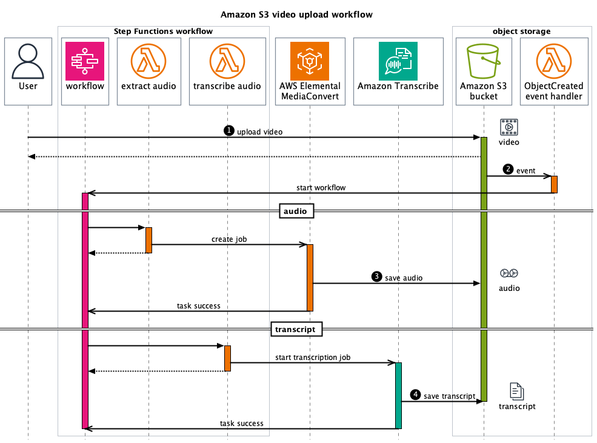
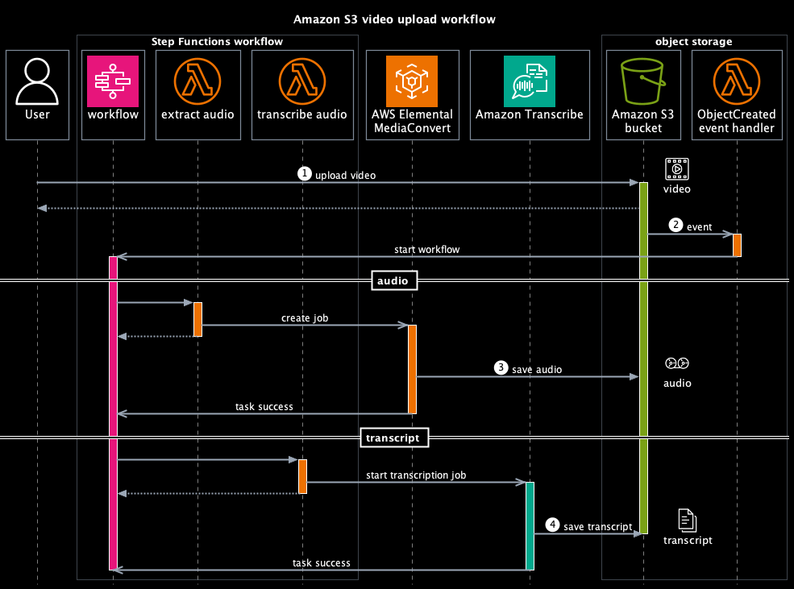

[Release 16.0](https://github.com/awslabs/aws-icons-for-plantuml/releases/tag/v16.0) of AWS Icons for PlantUML includes an experimental "dark mode" where  `!$AWS_DARK = true` will set the background/foreground colors and use icons which have a specific "dark" version.  This was possible because the 2023-04-28 (16-2023.04.28) updated [AWS Architecture Icons](https://aws.amazon.com/architecture/icons/) no longer have gradients and elements are designed to appear on either white or black backgrounds for optimal contrast and visibility.

The [S3 Upload Workflow examples](https://github.com/awslabs/aws-icons-for-plantuml/tree/main/examples/s3-upload-workflow) includes source code examples, but here are the side-by-side PNG images.

| Light Mode version | Dark Mode version|
|---|---|
|  |  |
|  |  |